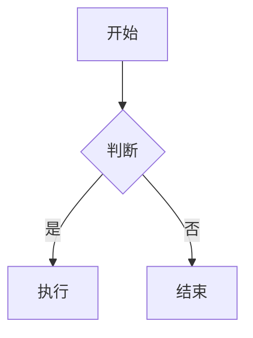

# Slidev Assist

使用 [Slidev](https://sli.dev)（Presentation Slides for Developers）从 Markdown 生成 PPT。**你给任何原材料——一个主题、一份研究报告、一堆数据、一段文案、一个现成的PPTX——我来解析、提炼、结构化成 slides.md，一键生成可演示的 HTML 幻灯片。**

## 快速开始

```
# 给我任何原材料，我都能做成PPT：
- 一个主题：   "帮我做一个AI Agent入门的PPT"
- 研究报告：   "读了这份PDF，帮我提炼成10页PPT"
- 数据报表：   "这份Excel数据，做成汇报PPT"
- 文案稿件：   "这段文字帮我做成演示"
- 已有PPTX：   "这个PPTX帮我转成Slidev版"
```

我会自动：
1. **解析原材料** — 读文件、提取关键信息、结构化
2. **编写 `slides.md`** — 加入合适的布局和动效
3. **安装并启动 Slidev** — 浏览器预览
4. **导出** — PDF / PPTX / PNG

## 一页 Slide 的 Markdown 模板

```markdown
---
# 全局配置（headmatter）— 只有第一页前面可以写
theme: default
title: 标题
---

# 第一页标题

内容正文

---

# 第二页标题

更多内容
```

- `---` 分隔每一页
- 每页开头可加 `---` 包裹的 frontmatter 设置该页布局

## 常用 Frontmatter 配置

| 字段 | 示例 | 说明 |
|------|------|------|
| `theme` | `default` / `seriph` / `unocss` | 主题 |
| `layout` | `center` / `cover` / `two-cols` / `image-right` / `image-left` | 页面布局 |
| `background` | `/bg.png` | 背景图 |
| `class` | `text-white p-10` | UnoCSS 类 |
| `preload` | `false` | 预加载 |
| `transition` | `slide-left` / `fade` | 切换动画 |
| `colorSchema` | `light` / `dark` / `auto` | 配色方案 |
| `fonts` | `{ sans: "Inter", mono: "Fira Code" }` | 字体配置 |
| `lineNumbers` | `true` / `false` | 代码行号 |
| `title` | `"我的演示"` | 全局标题 |

### 常用布局说明

- `cover` — 封面页，适合大标题居中
- `center` — 内容居中
- `two-cols` — 左右两栏（用 `::right::` 分隔）
- `image-right` — 左文右图（需设 `image` 字段）
- `image-left` — 左图右文
- `section` — 章节过渡页
- `statement` — 引语/强调页
- `default` — 默认页，标题在左上角

## 🎨 更改风格（主题/配色/字体）

Slidev 的风格通过 headmatter（第一页 `---` 之间的配置）控制。最常用的三种方式：

### 方式一：切换内置主题

```yaml
---
theme: default     # 默认简洁风（白底黑字）
# 或
theme: seriph      # 衬线字体风格（偏正式/学术）
# 或
theme: unocss      # UnoCSS 驱动，高度可自定义
---
```

直接在 headmatter 里改 `theme:` 的值即可切换整体风格。

### 方式二：安装社区主题

```bash
npm install slidev-theme-xxx
```

热门社区主题：

| 主题包 | 风格 |
|:-------|:-----|
| `slidev-theme-meetup` | 聚会/活动风格 |
| `slidev-theme-the-unnamed` | 深色科技风 |
| `slidev-theme-penguin` | 可爱企鹅风 |
| `slidev-theme-unicorn` | 多彩独角兽风 |

安装后 headmatter 里引用：

```yaml
---
theme: penguin
---
```

### 方式三：自定义配色和字体（无需装主题）

不改 theme，直接在 headmatter 里覆盖：

```yaml
---
theme: default
fonts:
  sans: Inter          # 正文字体
  mono: Fira Code      # 等宽字体（代码用）
  weights: '300,400,600'
  provider: google     # 字体来源（google / none）
colorSchema: light     # light / dark / auto
---
```

### 📌 每个页面可以单独设 layout

同一份 PPT 里不同页可以有不同的布局：

```yaml
---
layout: cover    # 封面页（大标题居中）
---

# 标题

---

---
layout: two-cols  # 左右两栏
---

# 左栏

::right::

# 右栏

---

---
layout: center   # 内容居中
---

# 居中展示
```

常用 layout 一览：

| layout | 用途 | 效果 |
|:-------|:-----|:-----|
| `default` | 通用内容页 | 标题在左上角 |
| `center` | 强调内容 | 全部居中 |
| `cover` | 封面 | 大标题居中，适合第一页 |
| `section` | 章节过渡 | 深色背景，大字标题 |
| `two-cols` | 对比/并列 | 左右两栏 |
| `image-right` | 左文右图 | 需设 `image:` 字段 |
| `image-left` | 左图右文 | 需设 `image:` 字段 |
| `statement` | 引语/金句 | 大字居中引语 |
| `fact` | 数据突出 | 大数字展示 |

### 💡 给 AI 的指令

如果用户说"换个风格"、"改主题"、"调配色"、"换字体"：
1. 优先用方式一（切内置 theme）——最快
2. 如果内置 theme 不够，尝试方式三（改 headmatter 的 fonts/colorSchema）
3. 如果用户想要特定风格且内置没有，尝试方式二（安装社区主题）
4. 如果用户说"这页布局不对"，修改对应页的 `layout:` 字段

## 语法特性

### 分隔内容
```markdown
---
layout: two-cols
---

# 左栏

左边内容

::right::

# 右栏

右边内容
```

### 代码高亮

````markdown
```ts {2-3}
function hello() {
  console.log('Hello')  // 第2-3行高亮
  console.log('Slidev')
}
```
````

### 代码行号
```markdown
```ts {*|1-2|3}{lines:true}
```
```

### 注释（演讲者备注）
```markdown
<!-- 这里写的不会显示在幻灯片上，只在演讲者模式可见 -->
```

### 图标
```
<carbon:logo-github />  — 使用 Iconify 任意图标
<carbon:book />
```

### 数学公式
```markdown
$E = mc^2$

$$
\frac{-b \pm \sqrt{b^2 - 4ac}}{2a}
$$
```

### Mermaid 图表
```markdown

```

### 内嵌 Vue 组件（高级）
```markdown
<Counter :start="5" />
<v-click> 点下一步才出现 </v-click>
<v-clicks> 每次点下一步出现一项 </v-clicks>
```

点击动画需要用 `v-click` / `v-clicks` 包裹。

## 完整示例（10页）

```markdown
---
theme: default
title: 我的演示
fonts:
  sans: Inter
---

# AI Agent 入门指南

从概念到实战 🚀

---

## 什么是 AI Agent？

- 能自主感知环境、做出决策并执行行动的智能实体
- 核心能力：推理、规划、工具调用、记忆

---

## 技术栈对比

| 特性 | 传统 AI | AI Agent |
|------|---------|----------|
| 交互方式 | 一问一答 | 自主执行 |
| 工具调用 | ❌ | ✅ |
| 长任务 | ❌ | ✅ |
| 记忆 | ❌ | ✅ |

---

## 总结

> AI Agent = 大模型 + 工具 + 记忆 + 规划
```

## 工作流程

1. **你**：提供原材料（主题/文件/数据/文案...）
2. **我**：解析原材料 → 提炼要点 → 结构化成 slides.md
3. **你**：确认/修改内容
4. **我**：检测环境 → 如未安装 Slidev 则自动安装 → 启动预览
5. **你**：浏览器打开链接即可查看/演示
6. **我**：主动询问用户对风格是否满意，并提供可切换的主题选项

## 支持解析的原材料类型

| 原材料 | 解析方式 | 输出效果 |
|:-------|:---------|:---------|
| 💬 **主题/想法** | AI 直接构思内容大纲 | 完整 PPT |
| 📄 **PDF 研究报告** | 读文件 → 提取关键论点 → 结构化 | 要点清晰的演示 |
| 📊 **Excel 数据** | 读取数据表格 → 提炼结论 → 图表化 | 数据汇报 PPT |
| 📝 **文案稿件** | 分段 → 提炼小标题 → 配图建议 | 美化排版 |
| 🎞️ **PPTX 文件** | python-pptx 解析 → AI 重建 | 带动效的 Slidev 版 |
| 🔗 **网页链接** | 抓取内容 → 摘要 → 结构化 | 知识整理演示 |
| 📚 **多源混搭** | 综合以上多种方式 | 跨材料整合汇报 |

## 导出

```bash
# PDF
npx slidev export slides.md

# PPTX（实验性）
npx slidev export slides.md --format pptx

# PNG 图片
npx slidev export slides.md --format png
```

## 工作流程

1. **你**：提供原材料（主题/文件/数据/文案...）
2. **我**：解析原材料 → 提炼要点 → 结构化成 slides.md
3. **你**：确认/修改内容
4. **我**：检测环境 → 如未安装 Slidev 则自动安装 → 启动预览
5. **你**：浏览器打开链接即可查看/演示
6. **我**：主动询问用户对风格是否满意，并提供可切换的主题选项

## 环境依赖声明

> ⚠️ **Slidev Assist 不是一个独立软件，而是一个调用开源项目的辅助工具。**
> 核心依赖是 [**Slidev**](https://github.com/slidevjs/slidev)（MIT 协议），
> 项目地址：https://github.com/slidevjs/slidev

每次生成 PPT 前必须确保目标环境已安装 Slidev。以下是检测和安装方式。

### 检测 Slidev 是否已安装

```bash
# 方式一：检查 CLI 是否可用
npx --yes @slidev/cli --version 2>/dev/null

# 方式二：检查本地 node_modules
test -d node_modules && npm ls @slidev/cli 2>/dev/null
```

有版本号返回 → 已安装。报错 → 执行安装。

### 安装 Slidev

```bash
# 方式一：npx 自动缓存（最省事，不需要手动装）
# npx @slidev/cli 首次运行会自动下载

# 方式二：npm 本地安装（推荐，支持导出）
cd 项目目录
npm install @slidev/cli

# 方式三：npm 全局安装
npm install -g @slidev/cli

# 方式四：官方 init 方式
npm init slidev
```

### 导出额外依赖

如需导出 PDF/PPTX，还需要 Playwright：

```bash
npm install -D playwright-chromium
```

### 推荐操作流程

```bash
# 1. 初始化项目
echo '{"name":"ppt","private":true}' > package.json

# 2. 安装 Slidev
npm install @slidev/cli

# 3. （可选）安装导出依赖
npm install -D playwright-chromium

# 4. 启动预览
npx @slidev/cli slides.md --remote
```

官方安装指南：https://github.com/slidevjs/slidev#getting-started

## 注意事项

- 首次运行 `npm install` 会耗时 1-3 分钟（下载依赖包）
- 预览默认在 `http://localhost:3030`
- 用 `--remote` 可以让手机上控制翻页
- 主题可以 npm 安装：`npm i slidev-theme-xxx`
- 文件类原材料需要你先上传/发给我，我来读取解析
