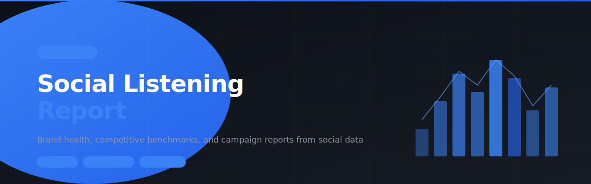

# social-listening-report



> SKILL.md for AI agents — Create brand health reports, competitive benchmarks, campaign performance analyses, and trend reports from social and digital media data. Works with Talkwalker, Brandwatch, Sprout Social, and manual data.

---

## Install

```
clawhub skill install social-listening-report
```

Or paste the repo URL directly into your OpenClaw chat and the agent will install it automatically.

---

## What it does

6 modules, all in one skill:

| Module | What it solves |
| --- | --- |
| **Brand Listening Report** | Full brand health report: volume, sentiment, channels, themes, and recommendations |
| **Competitive Benchmark** | Share of Voice, sentiment comparison, and content strategy analysis vs. competitors |
| **Campaign Performance Report** | Measure reach, engagement, sentiment, and ROI of any campaign |
| **Periodic Reports** | Monthly, quarterly, and annual report templates ready to fill in |
| **Trend & Insights Report** | Identify emerging topics and evaluate brand relevance before acting |
| **Metrics Glossary & Training** | SOV, sentiment, reach, impressions — definitions and common mistakes |

---

## Who it's for

Marketing strategists, insights researchers, brand managers, and agency analysts who need to turn raw social data into decisions.

---

## File structure

```
social-listening-report/
└── SKILL.md    ← Full skill (6 modules)
```

---

## Built with

- [OpenClaw](https://openclaw.ai)
- [ClawHub](https://clawhub.ai)

---

## License

MIT
