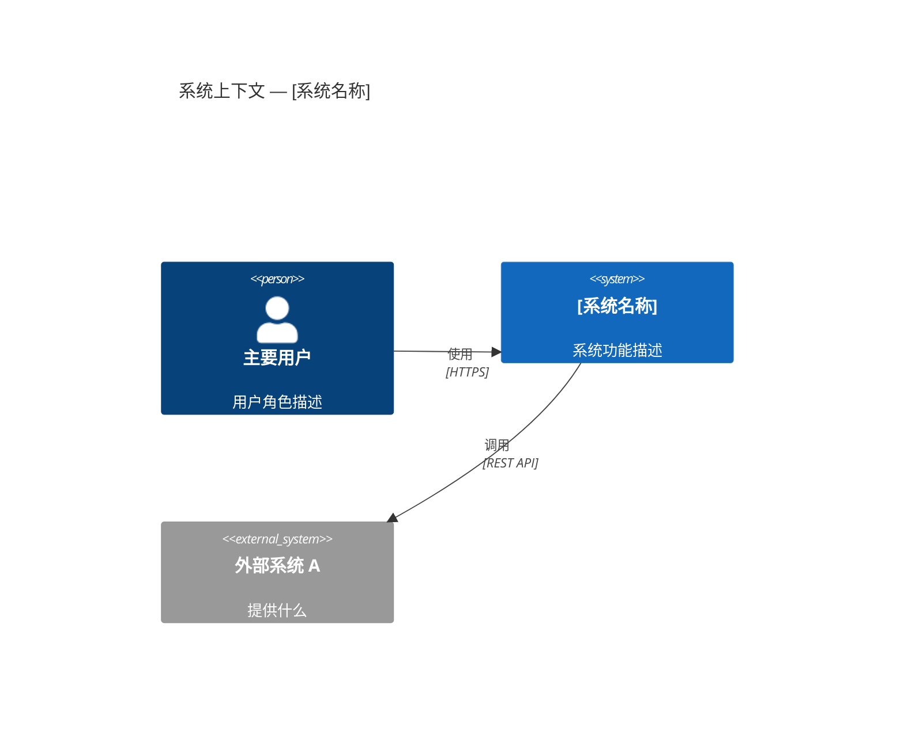
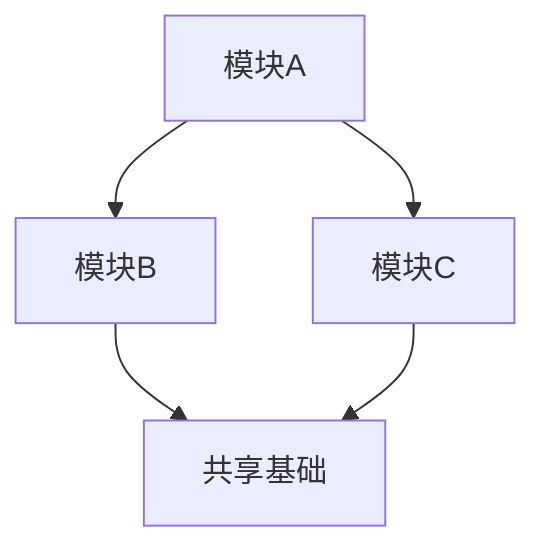
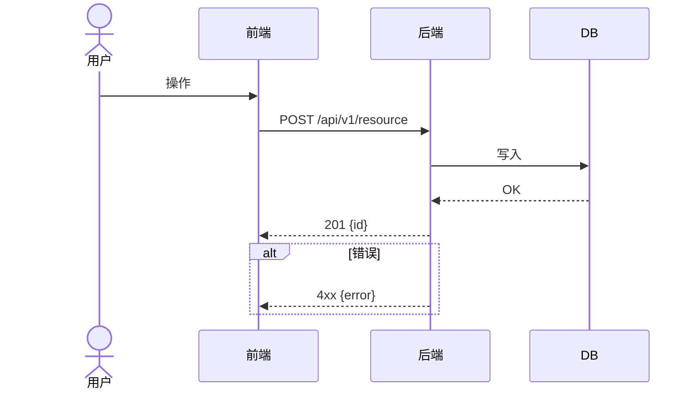
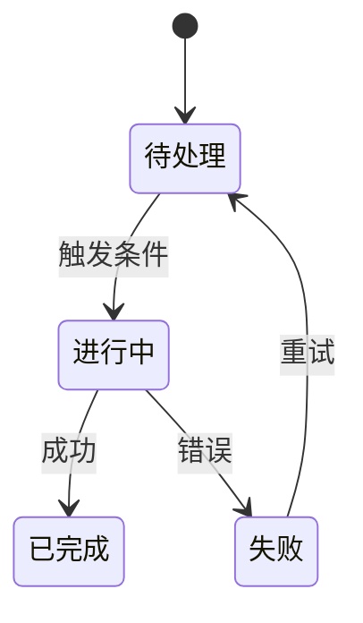
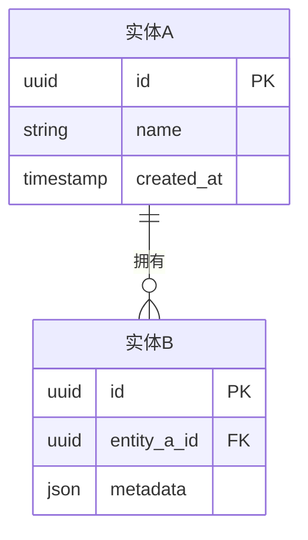
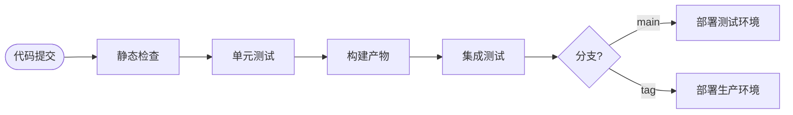

# Software Architecture Design SOP — Standalone Version

> **使用说明**：将本文件全文复制粘贴给任何 AI（ChatGPT、Claude、Gemini 等），
> 然后说"请按照上面的 SOP 帮我做架构设计"，AI 即可执行完整的 12 阶段流程。
> 本文件是 Cursor Skill 的自包含版本，不依赖任何外部文件引用。

---

## 架构类型识别（第一步）

在执行 12 阶段之前，先识别架构类型并加载对应的专项指导（本文末尾）：

| 类型 | 关键词 | 专项章节 |
|------|--------|---------|
| Web / API 后端 | API、后端、REST、微服务、SaaS | 附录 A |
| ML / AI 系统 | 模型、推理、算法平台、AI、LLM | 附录 B |
| 数据管道 | ETL、数据仓库、Kafka、Spark | 附录 C |
| 嵌入式 / IoT | 嵌入式、固件、MCU、CAN、硬件 | 附录 D |
| 移动端 | iOS、Android、Flutter、React Native | 附录 E |
| 通用 / 混合 | 无明显匹配 | 仅使用基础 SOP |

---

## 贯穿全程的核心原则

- **约束驱动**：每个决策都必须能追溯到一个硬约束（合规、预算、团队、部署环境）
- **决策显式化**：每个非平凡选择都必须展示「方案 A vs 方案 B（选定）+ 理由」
- **MVP 优先**：明确 MVP 边界，v1 不关键的全部延期
- **图表化**：每个主要阶段至少产出一张图，使用 Mermaid 或 PlantUML
- **可执行性**：架构必须能被指定团队用指定技术栈真正构建出来

---

## Phase 1 — 需求摄入

**输入**：需求文档、RFP、PRD、用户故事或口头描述。

1. 分类所有需求：
   - **功能性**：系统做什么（功能、用户旅程）
   - **非功能性**：性能、可用性 SLA、延迟、吞吐量、数据量
   - **合规/监管**：行业标准、数据驻留、审计要求
   - **部署约束**：离线/内网、云/本地、硬件限制、操作系统
2. 列出前 5 个用户角色及其主要使用场景
3. 记录所有明确的排除项（"不在范围内"）
4. 列出歧义和待确认问题，交用户解答后再继续

---

## Phase 2 — 系统上下文与边界

1. 绘制**系统上下文图**（C4 Level 1）：系统作为黑盒 + 外部用户 + 外部系统



2. 定义 MVP 交付边界（两张表）：
   - **MVP 包含**：功能 / 类别 / 验收标准
   - **MVP 不包含**：功能 / 计划版本 / 原因
3. 性能目标表：指标 / 目标值 / 测量方法

---

## Phase 3 — 分层架构

1. 选择架构模式并对照 Phase 1 约束说明理由：
   - 可选：分层（N 层）、事件驱动、微服务、插件化、管道过滤器、无服务器、单体优先
2. 定义 3–5 个层次：名称 / 职责 / 关键技术 / 与相邻层的协议
3. 产出**分层架构图**（PlantUML）：

```plantuml
@startuml
title 分层架构 — [系统名称]
rectangle "展示层" { component [UI] }
rectangle "业务层" { component [核心逻辑] }
rectangle "数据层" { component [存储访问] }
rectangle "基础设施层" { component [DB / 队列 / 存储] }
[UI] --> [核心逻辑] : HTTP/REST
[核心逻辑] --> [存储访问] : ORM/SDK
@enduml
```

---

## Phase 4 — 模块分解

1. 将每个层次分解为职责单一的模块
2. 绘制**模块依赖图**（有向无环图，不允许循环依赖）：



3. 每个模块：名称 / 所属层 / 一句话职责 / 关键技术

---

## Phase 5 — 核心业务流程

1. 识别 3–7 个最关键的端到端流程，每个流程产出时序图或流程图：



2. 为所有有状态实体定义**状态机**：



3. 每个流程记录异常处理：哪步失败 → 如何恢复 → 通知谁

---

## Phase 6 — 数据架构

1. 绘制**ER 图**：



2. 存储选型表：数据类型 → 存储组件 → 选型理由
   - 原则：选能满足约束的最简存储，不要过度工程化
3. 关键表结构：字段名 / 类型 / 索引
4. 数据生命周期：保留期限 / 归档策略 / 备份方案

---

## Phase 7 — 技术选型

1. 每个组件类别比较**恰好两个选项**（A vs B 选定）：

| 维度 | 方案 A | 方案 B（选定） |
|------|--------|--------------|
| 实现复杂度 | | |
| 运维开销 | | |
| 扩展上限 | | |
| 团队熟悉度 | | |
| 约束适配（列出满足/不满足哪条） | | |
| **结论** | | ✓ 选定，原因： |

2. 技术栈汇总表：类别 / 选型 / 版本 / 选型理由
3. 对照 Phase 1 约束逐项验证
4. 记录故意引入的技术债："MVP 选 X，v1.1 迁移到 Y，原因是..."

---

## Phase 8 — 接口设计

1. **外部 API**：所有端点列表（方法 / 路径 / 用途 / 同步或异步 / 是否需要认证）
2. **扩展接口（SPI）**：若系统可扩展，定义每个扩展必须实现的标准接口
3. **异步协议**：描述 WebSocket、SSE 或消息队列的协议契约
4. **错误响应格式**：标准错误体结构 + 错误码清单
5. **版本策略**：URL 路径版本（`/v1/`）或请求头版本

---

## Phase 9 — 部署架构

1. 绘制**部署拓扑图**（PlantUML）：

```plantuml
@startuml
title 部署拓扑 — [系统名称]
node "客户端" { component [浏览器/App] }
node "应用服务器" { component [API 服务]; component [Worker] }
node "数据服务器" { database [数据库]; storage [对象存储] }
[浏览器/App] --> [API 服务] : HTTPS
[API 服务] --> [数据库] : TCP
[Worker] --> [对象存储] : S3
@enduml
```

2. 服务器规格表：场景 / 规格 / 说明
3. 所有运行组件：名称 / 职责 / 端口 / 资源要求 / 重启策略
4. **CI/CD 流程**：



---

## Phase 10 — 非功能性设计

必须覆盖以下四个方面：

| 方面 | 需要说明的内容 |
|------|--------------|
| **高可用** | 每种故障场景：什么失败 / 如何恢复 / RTO 目标 |
| **性能** | 每个 NFR 目标 + 具体实现策略 |
| **安全** | 认证授权模型 / 数据隔离 / 密钥管理 / 审计日志 |
| **可观测性** | MVP 阶段：健康检查接口 + 关键日志；完整阶段：指标 + 告警体系 |

---

## Phase 11 — MVP 范围锁定

1. 最终确认 MVP 包含 / 不包含表（含目标版本）
2. **验收标准**：可量化的"MVP 完成"条件
3. 技术债清单：每项债务 + 理由 + 计划偿还版本

---

## Phase 12 — 风险登记

风险表：描述 / 概率（高/中/低）/ 影响（高/中/低）/ 应对措施

至少包含：
- 依赖风险（第三方库、硬件、外部 API）
- 集成风险（外部系统对接、合规验证）
- 交付风险（范围蔓延、需要 POC 验证的未知项）

---

## 输出文档结构

```
# [项目名] · [系统名] 架构设计文档

## 1. 文档说明（文档元数据表）
## 2. 项目范围与目标（背景 / MVP 边界 / 系统上下文图 / 性能目标）
## 3. 系统总体架构（架构模式 / 分层图 / 模块图）
## 4. 核心业务流程（时序图 / 流程图 / 状态机 / 异常处理）
## 5. 数据架构（ER 图 / 存储选型 / 表结构 / 生命周期）
## 6. 技术选型与关键决策（选型表 / A vs B 决策表）
## 7. 接口设计（API 表 / SPI 契约 / 错误码）
## 8. 部署与运行架构（部署拓扑图 / 服务器规格 / CI/CD）
## 9. 扩展性设计（插件规范 / 路线图）
## 10. 非功能性设计（HA / 性能 / 安全 / 可观测性）
## 11. 风险、待办与变更记录
```

---

# 附录 A — Web / API 后端专项

**Phase 3 模式选择**：单体优先（团队 < 5）→ 分层 → 微服务（有独立扩展需求时）→ 事件驱动（强解耦、异步为主时）

**Phase 6 存储升级路径**：
- 关系数据：SQLite → PostgreSQL（多进程写、JSONB 查询、复制时升级）
- 缓存/队列：进程内 → Redis（需跨进程共享、持久化时升级）
- 文件：本地文件系统 → 对象存储（需跨节点共享、CDN 时升级）

**Phase 8 API 规范**：
- 路径版本：`/api/v1/`
- 资源用名词：`/tasks` 不用 `/getTasks`
- 标准状态码：200/201/204/400/401/404/409/422/500
- 错误体：`{"error": {"code": "SNAKE_CASE", "message": "...", "details": {}}}`

**Phase 10 安全要点**：
- 所有公开端点加速率限制
- CORS 明确配置，生产不用通配符 `*`
- SQL 全部使用参数化查询 / ORM，禁止字符串拼接
- 密钥不进代码、不进 git，用 vault 或密钥管理服务

---

# 附录 B — ML / AI 系统专项

**Phase 3 标准四层**：
1. 服务 / 应用层（API 网关、用户界面）
2. 编排层（实验追踪、流水线调度、任务队列）
3. 执行 / 计算层（训练 Worker、推理服务器、GPU 调度）
4. 存储 / 注册层（模型注册、特征存储、数据集存储）

**Phase 5 必须记录的流程**：训练流程 / 推理流程 / 模型晋升流程 / 数据管道流程

**Phase 6 存储**：
- 模型权重 → 对象存储（版本化、不可变）
- 实验元数据 → 关系型 DB 或 MLflow
- 在线特征 → Redis（低延迟查询）
- 大型数据集 → 对象存储挂载，不复制

**Phase 8 推理 API 标准**：
```
POST /v1/predict
{"model_id": "...", "inputs": {...}}
→ {"prediction": {...}, "model_version": "1.0", "latency_ms": 42}

GET /health
→ {"status": "ok", "gpu_memory_free_mb": 8192, "model_loaded": true}
```

**Phase 10 特殊 NFR**：
- 推理延迟定义 P50/P95/P99 分别的目标
- GPU 动态显存调度，不固定串行
- 模型漂移监控：记录输入输出分布，定期检测
- 数据血缘：每个模型版本记录来自哪个数据集版本

---

# 附录 C — 数据管道专项

**Phase 3 模式**：批处理 ETL / 流批一体（Lambda）/ 纯流（Kappa）/ ELT / 湖仓（Medallion）

**Phase 5 必须记录**：摄入流 / 转换流 / 服务流 / 回填流 / 数据质量检查流

**Phase 6 分层存储**：
- 原始层（landing）→ 对象存储，不可变
- 清洗层 → Parquet 列式存储
- 策划层 → 数据仓库（ClickHouse、PostgreSQL、BigQuery）
- 服务层 → 列式 DB 或物化视图

**Phase 10 特殊 NFR**：
- 幂等性：每次运行安全重跑，不产生重复数据
- 数据质量告警：质检失败必须触发告警，不能静默通过
- 数据血缘：每张输出表必须能追溯来源表和转换逻辑版本

---

# 附录 D — 嵌入式 / IoT 专项

**Phase 3 强制分层**：
```
应用逻辑层
    ↓
硬件抽象层（HAL）
    ↓
板级支持包（BSP）/ 驱动
    ↓
物理硬件
```

**Phase 5 必须记录**：启动初始化流 / 中断服务流 / 通信协议流 / OTA 更新流 / 故障安全流

**Phase 8 必须定义**：
- 硬件接口：引脚映射、电压、时序、协议帧格式（CAN/UART/SPI）
- 调试接口：日志格式、JTAG/SWD 访问说明
- OTA 接口：包格式、校验和验证、回滚机制

**Phase 10 特殊 NFR**：
- 实时性：区分硬实时（超时=失败）vs 软实时，定义关键 ISR 最坏执行时间
- 内存预算：每个模块 RAM/Flash 使用上限
- 看门狗：必须由应用层喂狗，禁止在 ISR 中喂
- 失效安全状态：任何未处理错误的确定行为

---

# 附录 E — 移动端专项

**Phase 3 模式**：MVC（简单）→ MVVM（数据绑定）→ MVI/Redux（复杂状态）→ Clean Architecture（大型长期项目）

**Phase 5 必须记录**：冷启动流 / 认证流 / 数据同步流 / 离线流 / 推送通知流

**Phase 6 存储**：
- 结构化数据 → SQLite（Room / Core Data / sqflite）
- 凭证 / Token → Keychain（iOS）/ Keystore（Android），禁用 SharedPreferences 存凭证
- 大文件 → 本地磁盘缓存 + 对象存储远端

**Phase 9 发布产物**：
- iOS：.ipa → TestFlight 测试 → App Store
- Android：.aab → Firebase 测试 → Play Store
- CI/CD：Fastlane + GitHub Actions，自动化签名、版本号、上传

**Phase 10 特殊 NFR**：
- 冷启动 < 2s（在中低端设备上测量）
- 定义哪些功能离线可用，哪些必须联网
- 崩溃率目标：≥ 99.5% 无崩溃会话
- 定义最低支持 OS 版本
