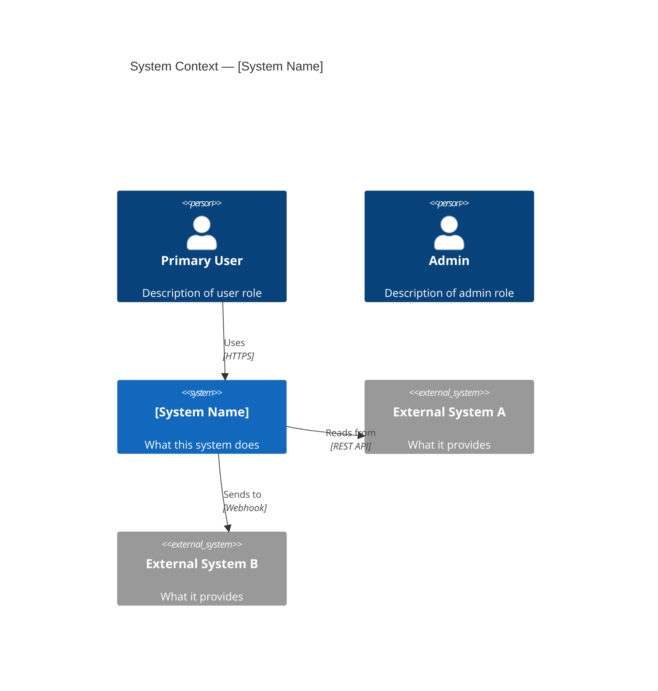
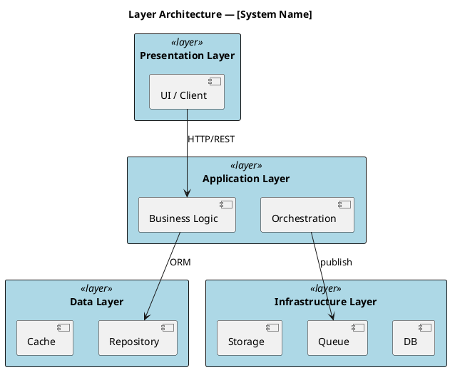
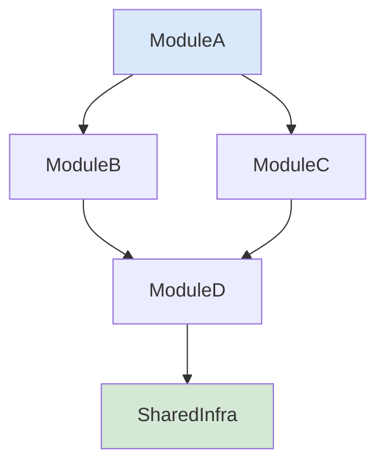
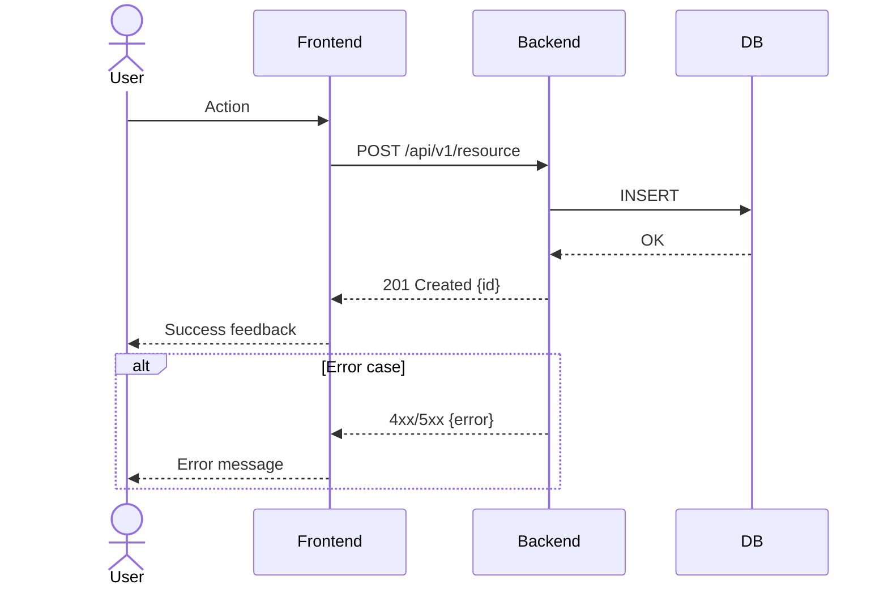
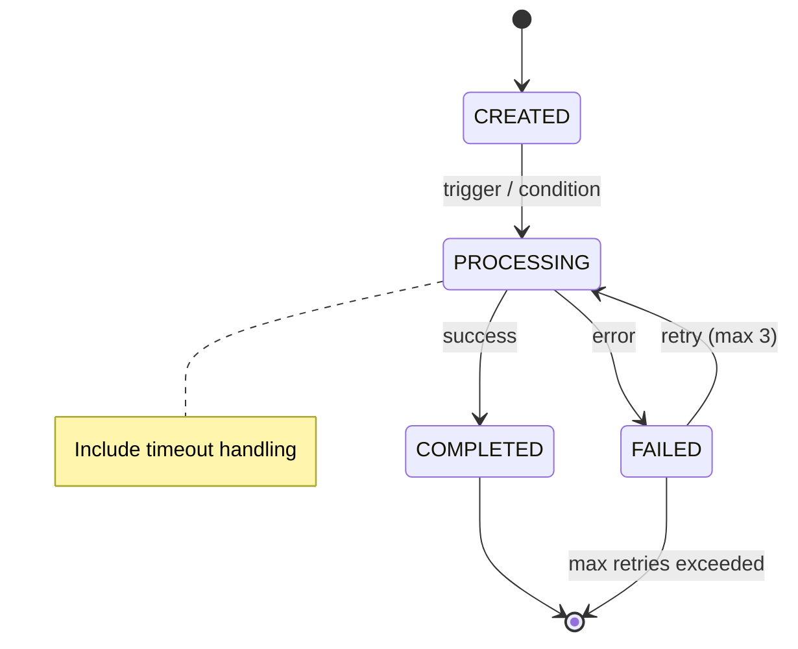
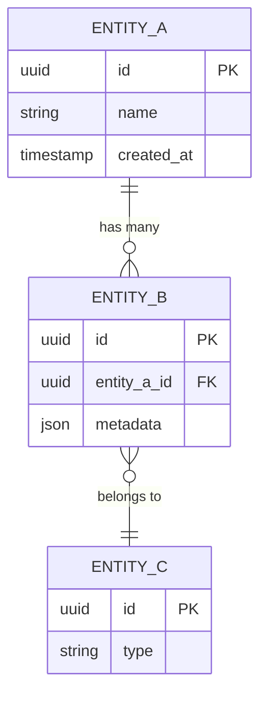
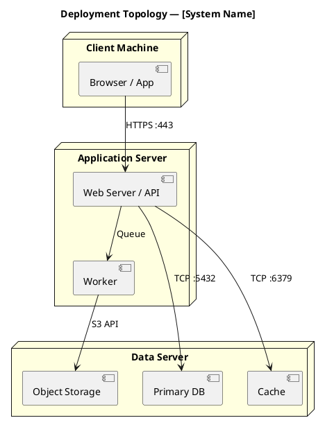
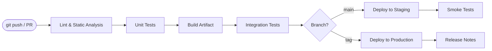

# Architecture Design — Reference

## Phase-by-Phase Checklist

### Phase 1: Requirement Intake
- [ ] All source documents read in full
- [ ] Functional requirements listed and numbered
- [ ] Non-functional: performance, availability, latency, throughput, data volume
- [ ] Compliance standards identified (ISO, GDPR, HIPAA, GB, IEC, etc.)
- [ ] Deployment constraints captured (air-gap, GPU, OS, cloud/on-prem, hardware)
- [ ] Top 5 user roles and use cases written
- [ ] Open questions listed for user to resolve

### Phase 2: System Context & Boundary
- [ ] System Context Diagram exists with all external actors and systems labeled
- [ ] MVP Includes table with success criteria per feature
- [ ] MVP Excludes table with target version per exclusion
- [ ] Performance targets table with measurement method

### Phase 3: Layered Architecture
- [ ] Architecture pattern named and justified against constraints
- [ ] Every layer: name / stack / responsibility / inter-layer protocol
- [ ] Layer architecture diagram exists

### Phase 4: Module Decomposition
- [ ] Every module: one-sentence responsibility
- [ ] No circular dependencies (verified)
- [ ] Module dependency diagram exists (DAG)

### Phase 5: Core Business Flows
- [ ] At least 3 critical flows documented with diagrams
- [ ] State machines for all stateful entities
- [ ] Exception paths documented per flow

### Phase 6: Data Architecture
- [ ] ER diagram covering all core entities
- [ ] Storage selection justified per data type
- [ ] Key schemas with field names and types
- [ ] Backup / retention policy stated

### Phase 7: Technology Selection
- [ ] Option A vs Option B table for each component
- [ ] Each selection validated against Phase 1 constraints
- [ ] No orphaned technologies (every tech appears in the architecture)
- [ ] Deliberate tech debt documented with rationale

### Phase 8: Interface Design
- [ ] All endpoints in a table (method, path, purpose, sync/async, auth)
- [ ] SPI/plugin contract defined if extensibility required
- [ ] Async protocol (WebSocket / SSE / queue) described
- [ ] Error response schema defined
- [ ] Versioning strategy stated

### Phase 9: Deployment Architecture
- [ ] Deployment topology diagram exists
- [ ] Server/hardware specs for min / recommended / production
- [ ] All runtime components with ports and resource requirements
- [ ] Volume / filesystem / data flow described
- [ ] CI/CD pipeline steps listed

### Phase 10: Non-Functional Design
- [ ] HA: failure scenarios and recovery strategies
- [ ] Performance: each metric + implementation strategy
- [ ] Security: auth, secrets, data isolation, audit
- [ ] Observability: MVP health endpoints + future metrics plan

### Phase 11: MVP Scope Lock
- [ ] MVP Includes / Excludes finalized
- [ ] Success criteria measurable
- [ ] Tech debt register complete

### Phase 12: Risk Register
- [ ] ≥ 5 risks documented
- [ ] Each risk: probability + impact + mitigation
- [ ] At least one dependency, one integration, one delivery risk

---

## Common Mistakes to Avoid

### Over-engineering for MVP
Choose the simplest technology that satisfies the constraint. Only escalate when you hit a documented limit.

Example pattern:
- Storage: local file → SQLite → PostgreSQL → distributed DB (escalate only when constrained)
- Queue: in-process queue → Redis → Kafka (escalate only when constrained)
- Deploy: single process → containers → orchestration (escalate only when constrained)

### Missing the "why" in decisions
Bad: "We use X for the job queue."
Good: "We use X because the requirement states tasks run for hours and must survive process restarts — an in-memory queue would lose tasks on crash."

### Underdefined extension contracts
If the system has plugins, webhooks, or adapters: define the interface precisely before implementation starts. Vague descriptions cause integration failures.

### No MVP boundary
Define MVP as: the minimum set of capabilities that delivers the stated value proposition. Every feature not in MVP gets a target version and a reason.

### Diagrams without labels
Every diagram must have: title, labeled nodes/actors, labeled edges (protocol + data), one-line caption.

### Architecture mismatch with constraints
Example: designing a stateless microservice when the deployment environment has no container orchestration. Every architecture decision must be validated against Phase 1 constraints.

---

## Decision Framework

For every significant technology or design decision:

| Dimension | Option A | Option B (selected) |
|-----------|----------|---------------------|
| Complexity to implement | | |
| Operational overhead | | |
| Scalability ceiling | | |
| Team familiarity | | |
| License / cost | | |
| Constraint fit (list which constraints it satisfies/fails) | | |
| **Verdict** | | ✓ Selected because: |

---

## Diagram Generation Guide

### Tool selection

| Situation | Use |
|-----------|-----|
| Sequence, flowchart, state, ER, simple graph | **Mermaid** — renders in GitHub, Notion, Typora, Cursor |
| C4 context/container/component, deployment topology, layered box-in-box | **PlantUML** — more expressive for structural diagrams |
| Cannot use either tool | Describe in structured text with ASCII art outline |

---

### 1. System Context Diagram (Phase 2) — Mermaid C4

---

### 2. Layer Architecture Diagram (Phase 3) — PlantUML

---

### 3. Module Dependency Diagram (Phase 4) — Mermaid

---

### 4. Sequence Diagram (Phase 5) — Mermaid

---

### 5. State Machine (Phase 5) — Mermaid

---

### 6. ER Diagram (Phase 6) — Mermaid

---

### 7. Deployment Topology (Phase 9) — PlantUML

---

### 8. CI/CD Pipeline (Phase 9) — Mermaid

---

## Diagram Rendering Environments

| Environment | Mermaid | PlantUML |
|-------------|---------|----------|
| GitHub Markdown | ✅ Native | ❌ Need plugin |
| Typora | ✅ | ✅ (with config) |
| Cursor IDE | ✅ | ✅ |
| Notion | ✅ (via block) | ❌ |
| draw.io | ❌ | ✅ (import) |
| VS Code | ✅ (extension) | ✅ (extension) |
