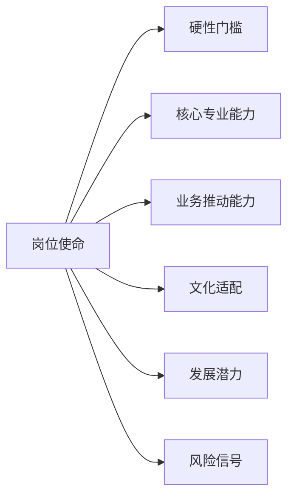

# 企业人才画像生成

## 目标

根据企业输入的岗位名称、企业文化、职级体系与业务背景，结合公开招聘平台中同类岗位的职责和任职要求，生成适用于本企业的岗位人才画像。输出应能直接服务于招聘 JD 优化、面试题设计、候选人评估和人才盘点。

## 输入要求

优先使用用户提供的信息。至少需要岗位名称；其余信息缺失时，先基于行业通用假设生成“待确认版本”，并明确列出待企业补充项。

建议收集：
- 岗位名称、所属部门、工作城市、行业、汇报对象。
- 职级或岗位层级，例如专员、主管、经理、高级经理、总监。
- 企业文化关键词，例如客户第一、结果导向、协作、创新、长期主义、合规稳健。
- 企业业务阶段，例如初创、快速增长、成熟经营、转型期。
- 岗位核心任务、现有 JD、目标薪酬区间、团队规模。
- 必须条件与加分条件。

## 外部招聘信息采集规则

当环境支持联网或招聘平台检索时，应主动搜索同类岗位的公开招聘信息。优先覆盖 boss 直聘、猎聘、拉勾、前程无忧、智联招聘，以及行业垂直平台或企业官网招聘页。

执行要求：
1. 使用岗位名称、同义岗位名、职级关键词和行业关键词进行检索。
2. 尽量收集 5 到 15 条同类岗位信息；若样本不足，说明样本不足的影响。
3. 提炼高频岗位职责、任职资格、工具技能、经验年限、学历专业、软性素质、管理要求和业务场景。
4. 不要逐字复制招聘平台文本；必须进行归纳、去重和改写。
5. 不要伪造检索来源。若无法联网或无法访问招聘平台，应说明限制，并要求用户提供 JD 样本或允许基于通用行业知识生成初版。
6. 遵守平台服务条款和隐私要求，不进行绕过登录、反爬、批量爬取或采集个人隐私信息。

## 分析框架

### 1. 岗位定位

明确该岗位在组织中的位置：岗位使命、业务目标、上下游协作对象、核心交付物、对业务结果的贡献方式。

### 2. 市场岗位共性提炼

将外部岗位样本归纳为：
- 高频职责：重复出现且与岗位本质相关的工作内容。
- 高频硬技能：工具、方法、系统、专业知识、行业经验。
- 高频软素质：沟通、推动、抗压、结构化思维、学习能力等。
- 职级差异：初级重执行，中级重独立负责，高级重方法沉淀和跨部门推动，管理层重团队、策略和资源协调。

### 3. 企业文化适配

把企业文化转译为可观察行为，不要停留在口号。例如：
- 结果导向：能拆解目标、定义指标、按周期复盘。
- 协作：能主动对齐边界、推动跨部门问题闭环。
- 创新：能基于业务问题提出可验证方案，而非只提出想法。
- 合规稳健：能识别风险、保留证据链、遵守流程。

### 4. 职级校准

根据岗位职级调整能力要求：
- 初级：执行准确、学习快、反馈及时。
- 中级：能独立负责模块，处理常见复杂问题。
- 高级：能设计机制、沉淀方法、影响他人。
- 专家：能解决高复杂度问题，形成组织能力。
- 管理者：能定目标、搭团队、管资源、拿结果。

### 5. 人才画像形成

将岗位要求整合为“硬性门槛、核心能力、文化适配、发展潜力、风险信号”五类，不得只罗列泛泛素质。

## 标准输出格式

默认使用中文输出，结构如下。

### 一、岗位基础画像

| 维度 | 内容 |
|---|---|
| 岗位名称 |  |
| 所属职能 |  |
| 建议职级 |  |
| 岗位使命 |  |
| 核心交付物 |  |
| 关键协作对象 |  |
| 业务价值 |  |

### 二、外部招聘市场基准摘要

| 来源类型 | 共性职责 | 共性要求 | 对本企业的启示 |
|---|---|---|---|
| boss 直聘等综合招聘平台 |  |  |  |
| 垂直招聘或行业样本 |  |  |  |
| 企业官网或标杆公司 JD |  |  |  |

若无联网能力，改为“基于通用岗位知识的初版市场基准”，并明确提示需要企业补充样本验证。

### 三、本企业岗位人才画像表

| 一级维度 | 二级指标 | 具体画像描述 | 必须/加分 | 评估方式 |
|---|---|---|---|---|
| 硬性条件 | 学历/专业/年限 |  |  | 简历筛选 |
| 专业技能 | 工具/方法/系统/行业知识 |  |  | 笔试/案例/面试 |
| 业务能力 | 目标拆解/项目推进/问题解决 |  |  | 行为面试/案例追问 |
| 协作能力 | 跨部门沟通/资源协调 |  |  | STAR 追问 |
| 文化适配 | 与企业文化对应的可观察行为 |  |  | 价值观面试 |
| 发展潜力 | 学习能力/复盘能力/可塑性 |  |  | 成长经历追问 |
| 风险信号 | 与岗位失败高度相关的表现 |  |  | 简历与面试交叉验证 |

### 四、理想候选人画像

用 1 到 2 段文字描述理想候选人，包括经历背景、能力结构、行为风格、文化适配点和可成长方向。

### 五、面试评估建议

| 评估模块 | 建议问题 | 追问方向 | 判断标准 |
|---|---|---|---|
| 专业能力 |  |  |  |
| 业务理解 |  |  |  |
| 项目经验 |  |  |  |
| 文化适配 |  |  |  |
| 风险验证 |  |  |  |

### 六、人才画像图

用文字图或 Mermaid 结构图表达人才画像。默认输出 Mermaid：

根据实际岗位替换节点内容，避免空泛标签。

## 质量要求

- 人才画像必须与岗位名称、职级和企业文化绑定，不能输出通用模板。
- 必须区分“必须项”和“加分项”，避免过度拔高导致招聘不可行。
- 必须给出可观察、可评估的行为描述。
- 不得使用性别、年龄、婚育、民族、宗教、户籍、残障等非岗位必要因素作为筛选或画像依据。
- 对于“抗压、稳定、聪明、主动”等抽象词，必须转化为行为证据。
- 若信息不足，应在输出开头列出“关键缺失信息与影响”，但仍给出可迭代初版。
