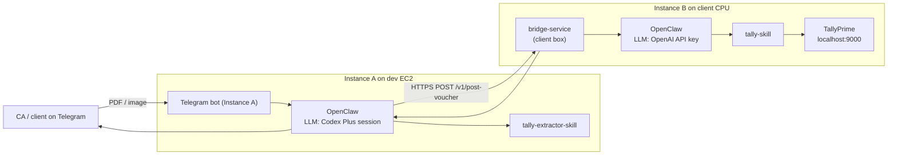

# Tally Extractor Skill

Extract invoice/bill data from PDFs and images received via Telegram or WhatsApp, convert to a canonical JSON payload, and POST to the bridge service on Instance B for Tally entry.

- **No direct Tally access**: This skill does NOT connect to TallyPrime. Voucher posting is handled by `tally-skill` on Instance B.
- **Telegram/WhatsApp interface**: User sends PDF/image → this skill extracts → bridge → Tally.
- **Structured output**: Always emit the canonical JSON schema (see `reference/extraction-schema.md`).

## Hero Use Case: Telegram invoice → Tally entry

Goal: zero manual entry for CAs handling many clients.

1. User sends invoice PDF/image via Telegram.
2. This skill extracts: company, party, GSTIN, date, invoice no, items (description, HSN, qty, rate, tax), total.
3. Validate extraction: tax math check, GSTIN format, required fields present.
4. POST canonical JSON to bridge (`/v1/post-voucher`).
5. Receive result from bridge and reply to user in accountant-friendly language.

## When to use this skill

**Scope note:** This skill is for **Instance A** (Extractor). It does **not** post to Tally — that responsibility belongs to `tally-skill` on Instance B.

Use when:

- User sends a PDF or image of an invoice/bill via Telegram/WhatsApp
- User requests to extract data from a document
- User asks to "add this invoice to Tally" (extract + forward to bridge)
- User provides invoice details as text message (parse and forward)

Do NOT use this skill for:

- Direct Tally operations (reports, ledger queries) — those go to Instance B
- PDF generation (`tallyca` runs on Instance B)
- Master management (ledgers, groups) — that's on Instance B

## Critical rules (must follow)

1. **Never hallucinate data**: If a field is unclear or missing from the document, mark it as low-confidence or ask the user. Do not invent GSTINs, HSN codes, or amounts.
2. **Validate GSTIN format**: 15 characters, pattern `^[0-9]{2}[A-Z]{5}[0-9]{4}[A-Z]{1}[1-9A-Z]{1}Z[0-9A-Z]{1}$`. If invalid, flag it.
3. **Validate HSN format**: 4-8 digits. If invalid, flag it.
4. **Tax math check**: `taxable_amount × tax_rate / 100 ≈ tax_amount` (within ±0.01). If mismatch, flag it.
5. **Total check**: Sum of item amounts + taxes = total (within ±1 for rounding). If mismatch, flag it.
6. **Place of Supply**: Derive from first 2 digits of party GSTIN (state code). Map to state name using `reference/extraction-schema.md` state code table.
7. **Inter-state vs Intra-state**: If company GSTIN state ≠ party GSTIN state → IGST. If same state → CGST + SGST.
8. **Dates**: Extract as `YYYY-MM-DD`. Common formats on invoices: `DD/MM/YYYY`, `DD-MM-YYYY`, `DD.MM.YYYY`, `MMM DD, YYYY`.
9. **Idempotency key**: Generate deterministic GUID using pattern `{companyShort}-{voucherType}-{invoiceNumber}-{date}`.
10. **Confidence scores**: Assign confidence (0.0-1.0) to each extracted field. Flag fields with confidence < 0.7 for user confirmation.

## Extraction workflow

### Step 1: Receive document

User sends PDF or image via Telegram. The document is available for OCR/vision processing.

### Step 2: Check bridge health

Before extraction, verify Instance B is reachable:

```bash
curl -s -X GET \
  -H "Authorization: Bearer $BRIDGE_BEARER" \
  "$BRIDGE_URL/v1/health"
```

Expected response:

```json
{
  "tally": "ok",
  "company_default": "ABC Company",
  "version": "1.0.0"
}
```

If `tally: "down"`, inform user: "Tally is not running on the client machine. Please ask them to open TallyPrime."

### Step 3: Extract data

Parse the document and extract:

| Field | Source | Validation |
|---|---|---|
| Party name | Invoice header | Required |
| Party GSTIN | Near party name or GST section | 15-char format |
| Company GSTIN | Near company name or letterhead | 15-char format |
| Invoice number | Invoice header | Required |
| Invoice date | Invoice header | Parse to `YYYY-MM-DD` |
| Items | Line items table | At least one |
| Item description | Line item | Required per item |
| HSN/SAC | Line item | 4-8 digits |
| Quantity | Line item | Numeric |
| Unit | Line item | Optional |
| Rate | Line item | Numeric |
| Tax rate | Line item or GST section | Percentage |
| CGST/SGST/IGST amounts | GST section | Numeric |
| Total | Invoice footer | Required, must balance |
| Narration | Notes section | Optional |

### Step 4: Determine voucher type

| Document type | Voucher type |
|---|---|
| Purchase invoice (we are buyer) | `Purchase` |
| Sales invoice (we are seller) | `Sales` |
| Payment receipt | `Receipt` |
| Payment voucher | `Payment` |
| Credit note | `CreditNote` |
| Debit note | `DebitNote` |

Clues:
- "Tax Invoice" with company as seller → Sales
- "Tax Invoice" with company as buyer → Purchase
- "Receipt" or "Payment Received" → Receipt
- "Credit Note" in header → CreditNote

If ambiguous, ask user: "Is this a purchase (you bought) or sales (you sold)?"

### Step 5: Validate extraction

Run these checks before sending to bridge:

| Check | Rule | Action if fails |
|---|---|---|
| Required fields | All required fields present | List missing fields, ask user |
| GSTIN format | 15-char regex match | Flag invalid, ask user |
| HSN format | 4-8 digits | Flag invalid, ask user |
| Tax math | taxable × rate / 100 ≈ tax | Flag mismatch, ask user |
| Total balance | items + taxes = total (±1) | Flag mismatch, ask user |
| Date parseable | Valid date | Ask user for correct date |

### Step 6: Build canonical JSON

Construct the JSON payload per `reference/extraction-schema.md`:

```json
{
  "schema_version": "1.0",
  "request_id": "uuid-v4",
  "idempotency_key": "abc-purchase-xyz-186-20260518",
  "company": "ABC Company",
  "voucher": {
    "type": "Purchase",
    "date": "2026-05-18",
    "number": "186",
    "is_invoice_mode": true,
    "voucher_class": null,
    "narration": "Against Invoice 186",
    "party": {
      "name": "XYZ Party",
      "gstin": "27AABCU9603R1ZM",
      "place_of_supply": "Maharashtra",
      "registration_type": "Regular"
    },
    "company_gstin": "27AABCU9603R1ZN",
    "items": [...],
    "taxes": {...},
    "total": 46199.83,
    "bill_allocations": [...]
  },
  "source": {
    "kind": "pdf",
    "filename": "invoice_186.pdf",
    "extracted_at": "2026-05-18T10:30:00Z"
  },
  "confidence": {
    "overall": 0.93,
    "fields": {...}
  }
}
```

### Step 7: POST to bridge

Send the JSON to Instance B:

```bash
# Compute HMAC
BODY='{"schema_version":"1.0",...}'
SIGNATURE=$(echo -n "$BODY" | openssl dgst -sha256 -hmac "$BRIDGE_HMAC_SECRET" | cut -d' ' -f2)

curl -X POST \
  -H "Content-Type: application/json" \
  -H "Authorization: Bearer $BRIDGE_BEARER" \
  -H "X-Signature: hmac-sha256=$SIGNATURE" \
  -H "Idempotency-Key: abc-purchase-xyz-186-20260518" \
  -d "$BODY" \
  "$BRIDGE_URL/v1/post-voucher"
```

Full HTTP contract in `reference/bridge.md`.

### Step 8: Handle response

#### Success

```json
{
  "status": "posted",
  "guid": "abc-purchase-xyz-186-20260518",
  "voucher_number": "186",
  "company": "ABC Company",
  "summary": "Purchase voucher posted: XYZ Party, ₹46,199.83",
  "masters_created": ["XYZ Party"]
}
```

Reply to user (see `reference/prompts.md`):

> Entry posted to Tally.
> 
> **Company:** ABC Company  
> **Type:** Purchase  
> **Party:** XYZ Party  
> **Invoice No:** 186  
> **Date:** 18 May 2026  
> **Amount:** ₹46,199.83 (Taxable: ₹39,152.40 + IGST: ₹7,047.43)
> 
> New ledger created: XYZ Party

#### Needs Clarification

```json
{
  "status": "needs_clarification",
  "missing_fields": ["voucher.voucher_class"],
  "message": "Please confirm the voucher class name (e.g., 'Purchase @ 18 %')."
}
```

Forward the question to the user.

#### Error

```json
{
  "status": "error",
  "error_code": "TALLY_UNREACHABLE",
  "message": "Could not connect to Tally."
}
```

Reply to user: "Tally is not responding. Please check that TallyPrime is open and try again."

## Company name handling

The company name must match exactly in TallyPrime. Strategies:

1. **Explicit in document**: Extract from invoice letterhead
2. **User specified**: User may say "Add to ABC Company"
3. **Default from bridge**: `/v1/health` returns `company_default`
4. **Ask user**: If unclear, ask "Which Tally company should this entry go to?"

## Voucher class handling

Some Tally companies use voucher classes for automatic GST splitting. This skill does NOT know which class to use — that's Instance B's job.

- If user specifies class in message (e.g., "use Sales @ 18 %"), include in JSON
- If not specified, leave `voucher_class: null` and let Instance B handle it
- If Instance B returns `needs_clarification` for class, forward to user

## Confidence scoring

Assign confidence scores based on:

| Extraction quality | Confidence |
|---|---|
| Clear text, high contrast, exact match | 0.95 - 1.0 |
| Readable but some ambiguity | 0.7 - 0.94 |
| Blurry, low contrast, guessed | 0.4 - 0.69 |
| Highly uncertain | 0.0 - 0.39 |

Fields with confidence < 0.7 should be flagged for user confirmation before posting.

## State code to state name mapping

First 2 digits of GSTIN → Place of Supply:

| Code | State |
|---|---|
| 01 | Jammu and Kashmir |
| 02 | Himachal Pradesh |
| 03 | Punjab |
| 04 | Chandigarh |
| 05 | Uttarakhand |
| 06 | Haryana |
| 07 | Delhi |
| 08 | Rajasthan |
| 09 | Uttar Pradesh |
| 10 | Bihar |
| 11 | Sikkim |
| 12 | Arunachal Pradesh |
| 13 | Nagaland |
| 14 | Manipur |
| 15 | Mizoram |
| 16 | Tripura |
| 17 | Meghalaya |
| 18 | Assam |
| 19 | West Bengal |
| 20 | Jharkhand |
| 21 | Odisha |
| 22 | Chhattisgarh |
| 23 | Madhya Pradesh |
| 24 | Gujarat |
| 25 | Daman and Diu |
| 26 | Dadra and Nagar Haveli |
| 27 | Maharashtra |
| 28 | Andhra Pradesh (Old) |
| 29 | Karnataka |
| 30 | Goa |
| 31 | Lakshadweep |
| 32 | Kerala |
| 33 | Tamil Nadu |
| 34 | Puducherry |
| 35 | Andaman and Nicobar Islands |
| 36 | Telangana |
| 37 | Andhra Pradesh |
| 38 | Ladakh |

## Deployment topology

There is exactly **one chat interface** (Telegram on Instance A). Instance B has no Telegram/WhatsApp — only the bridge HTTP endpoint.



| Environment | Instance A | Instance B | Tally access |
|---|---|---|---|
| **Production** | Your EC2 (Telegram, Codex Plus) | Client mini-PC beside Tally | B → `http://localhost:9000` (no ngrok for Tally) |
| **Dev / testing** | Same Ubuntu EC2 | Second OpenClaw on same EC2 | B uses ngrok URL to remote Tally |

Instance A reaches B via an inbound tunnel on the **client box** (`ngrok http 8787` or Cloudflare Tunnel). Share `BRIDGE_URL`, `BRIDGE_BEARER`, and `BRIDGE_HMAC_SECRET` with the team running A.

## Instance A configuration checklist

| Step | Setting | Value |
|---|---|---|
| 1 | Host | Ubuntu EC2 (or dev server) |
| 2 | Install | Node.js, OpenClaw |
| 3 | LLM | OpenAI **ChatGPT Codex Plus** session (subscription) |
| 4 | Skill loaded | `tally-extractor-skill/` only — **do not** load `tally-skill/` |
| 5 | Channel | Telegram bot token on A only |
| 6 | `BRIDGE_URL` | `https://<client-tunnel>.ngrok.app` (no trailing slash) |
| 7 | `BRIDGE_BEARER` | Shared secret from client team |
| 8 | `BRIDGE_HMAC_SECRET` | Shared HMAC secret from client team |
| 9 | **Do not set** | `TALLY_URL` on Instance A |
| 10 | Preflight | `curl -H "Authorization: Bearer $BRIDGE_BEARER" $BRIDGE_URL/v1/health` → `tally: ok` |

## Reference files

- **Extraction schema**: `reference/extraction-schema.md` — Full JSON schema, examples
- **Bridge HTTP contract**: `reference/bridge.md` — Endpoints, auth, errors
- **Reply templates**: `reference/prompts.md` — User-facing messages
