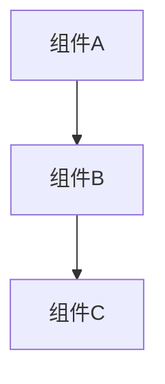

# [项目名] 架构设计文档

> 版本：v1.0
> 日期：YYYY-MM-DD
> 关联决策：[决策文件路径]

## 系统概览

[一句话描述系统做什么、为谁服务]

## 架构图

## 模块说明

### [模块名]
- **职责**：
- **输入**：
- **输出**：
- **依赖**：

### [模块名]
- **职责**：
- **输入**：
- **输出**：
- **依赖**：

## 数据流

[描述数据如何在模块间流转]

## 接口设计

| 接口 | 方法 | 输入 | 输出 | 说明 |
|------|------|------|------|------|
| | | | | |

## 非功能需求

- **性能**：
- **安全**：
- **可扩展性**：
- **容错**：

## 部署方案

[部署环境、方式、依赖]
