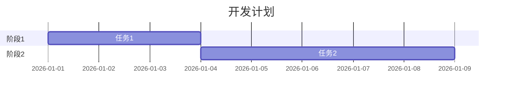

# [项目名] 开发规划

> 日期：YYYY-MM-DD
> 关联讨论：[讨论文件路径]
> 关联决策：[决策文件路径]
> 关联架构：[架构文件路径]

## 技术栈

[根据决策文档填写]

## 开发阶段

### 阶段 1：[阶段名]
- [ ] 任务1
- [ ] 任务2
- 预计耗时：X天

### 阶段 2：[阶段名]
- [ ] 任务1
- [ ] 任务2
- 预计耗时：X天

### 阶段 3：[阶段名]
- [ ] 任务1
- [ ] 任务2
- 预计耗时：X天

## 里程碑

| 里程碑 | 目标 | 交付物 | 预计日期 |
|--------|------|--------|----------|
| M1 | | | |
| M2 | | | |
| M3 | | | |

## 甘特图

## 风险评估

| 风险 | 影响 | 概率 | 应对措施 |
|------|------|------|----------|
| | | | |
