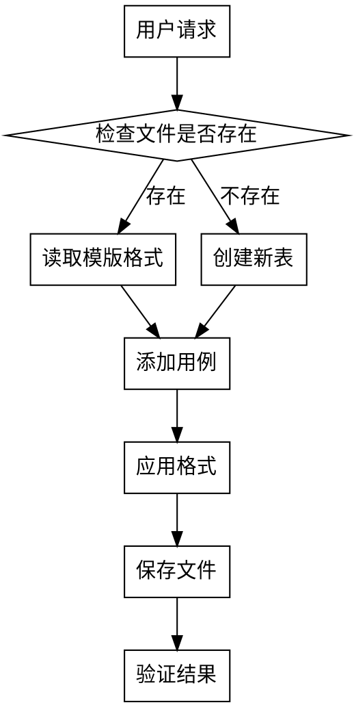

# 测试用例表管理

## Overview

用于创建和管理软件回归测试用例表的Excel文件，确保格式一致性和规范化的测试用例文档。

## When to Use

- 用户要求创建测试用例表
- 需要向现有测试用例表添加新的测试用例
- 需要调整测试用例表格式使其符合模版
- 需要清理重复数据或重新格式化表格

## Standard Table Structure

**表头（14列）：**
| 列 | 字段名 | 列宽 |
|---|--------|------|
| A | 序号 | 13.0 |
| B | 用例ID | 37.125 |
| C | 所属模块 | 17.125 |
| D | 用例标题 | 75.375 |
| E | 优先级 | 12.125 |
| F | 前置条件 | 95.625 |
| G | 测试步骤 | 50.625 |
| H | 预期结果 | 60.75 |
| I | 实际结果 | 68.375 |
| J | 状态 | 11.5 |
| K | 缺陷ID | 13.0 |
| L | 测试者 | 13.0 |
| M | 执行日期 | 15.625 |
| N | 备注 | 13.0 |

## Format Specifications

### 表头格式
- 字体：粗体，大小11
- 背景：黄色（FFFFFF00）
- 对齐：水平居中、垂直居中
- 边框：细线边框

### 数据行格式
- 行高：105
- 对齐：自动换行（wrap_text=True）、垂直顶部对齐
- 边框：细线边框
- 内容：多行文本使用换行符分隔步骤

### 用例ID命名规范
格式：`项目名_模块_序号`
示例：`TPClawHub_Login_001`

### 优先级标准
- P0：核心功能，必须通过
- P1：重要功能，应该通过
- P2：次要功能，可选通过

## Implementation

### 创建新表

```python
from openpyxl import Workbook
from openpyxl.styles import Font, PatternFill, Alignment, Border, Side

wb = Workbook()
sheet = wb.active
sheet.title = "测试用例表"

headers = ['序号', '用例ID', '所属模块', '用例标题', '优先级', '前置条件',
           '测试步骤', '预期结果', '实际结果', '状态', '缺陷ID', '测试者', '执行日期', '备注']

for col, header in enumerate(headers, 1):
    cell = sheet.cell(row=1, column=col, value=header)
    cell.font = Font(bold=True, size=11)
    cell.fill = PatternFill(start_color='FFFFFF00', end_color='FFFFFF00', fill_type='solid')
    cell.alignment = Alignment(horizontal='center', vertical='center')

column_widths = {'A':13, 'B':37, 'C':17, 'D':75, 'E':12, 'F':95, 'G':50, 'H':60, 'I':68, 'J':11, 'K':13, 'L':13, 'M':15, 'N':13}
for col, width in column_widths.items():
    sheet.column_dimensions[col].width = width

wb.save('测试用例表.xlsx')
```

### 添加测试用例

```python
from openpyxl import load_workbook
from openpyxl.styles import Alignment, Border, Side

wb = load_workbook('测试用例表.xlsx')
sheet = wb.active

# 找到最后一行
last_row = 2
for row in range(2, sheet.max_row + 1):
    if sheet.cell(row=row, column=2).value:
        last_row = row

new_case = ['序号', '用例ID', '所属模块', '用例标题', '优先级',
            '前置条件', '测试步骤', '预期结果', '', '', '', '', '', '备注']

thin_border = Border(left=Side(style='thin'), right=Side(style='thin'),
                     top=Side(style='thin'), bottom=Side(style='thin'))
data_alignment = Alignment(wrap_text=True, vertical='top')

for col_idx, val in enumerate(new_case, 1):
    cell = sheet.cell(row=last_row + 1, column=col_idx)
    cell.value = val
    cell.alignment = data_alignment
    cell.border = thin_border
sheet.row_dimensions[last_row + 1].height = 105

wb.save('测试用例表.xlsx')
```

## Common Mistakes

| 问题 | 解决方案 |
|------|----------|
| 格式丢失 | 使用完整样式对象重新应用格式 |
| 文件占用 | 提示用户关闭Excel后再操作 |
| 重复数据 | 遍历用例ID去重后重写 |
| 列宽不匹配 | 按标准列宽表重新设置 |

## Workflow

