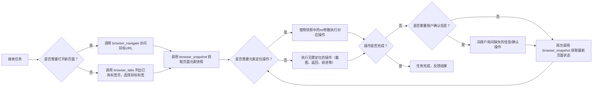

# SKILL.md - 浏览器自动化操作 Skill

## 基本信息
- **Skill名称**: browser-automation
- **Skill ID**: browser_automation_20260507
- **适用场景**: 所有需要通过浏览器完成的网页操作任务
- **依赖MCP**: tai-app-browser-mcp-server

## 触发条件
当用户请求满足以下任意场景时，优先使用本Skill：
1. 明确提到"使用浏览器"、"打开网页"、"访问网站"等关键词
2. 需要填写网页表单、提交信息、注册账号等操作
3. 社交媒体操作：发布微博、小红书、抖音内容，评论、点赞等
4. 邮件操作：查看邮件、发送邮件、管理邮箱
5. 信息查询：网页搜索、查看新闻、查询公开信息
6. 自动化操作：重复网页操作、批量数据录入、网页数据提取
7. 其他需要网页交互的场景

## 前置检查流程
### 1. 浏览器可用性检查
```mermaid
flowchart LR
    A[开始] --> B{调用 browser_exists}
    B -->|存在| C[继续执行任务]
    B -->|不存在| D[询问用户："检测到未安装联想浏览器，是否需要自动安装？"]
    D -->|同意| E[调用 browser_install 进行安装]
    E --> F{安装是否成功？}
    F -->|是| C
    F -->|否| G[提示用户："浏览器安装失败，请手动安装后重试"]
    D -->|不同意| H[终止任务，告知用户需要浏览器支持]
```

### 2. 环境确认
- 检查浏览器版本≥9.0.8.4270
- 确认当前网络连接正常
- 清理可能存在的弹窗和干扰元素

## 核心执行流程


## 操作规范
### 1. 页面导航规范
- 新任务默认使用新标签页打开，避免影响用户已有页面
- 导航前确认URL正确性，避免访问恶意网站
- 页面加载后等待2秒或等待关键元素出现，再进行后续操作
- 若页面加载超时（超过10秒），提示用户检查网络或重试

### 2. 元素定位规范
- **强制要求**：所有需要点击、输入、选择的操作，必须先调用 `browser_snapshot` 获取页面元素引用(`ref`)
- 优先使用`ref`参数定位元素，不允许使用CSS选择器或XPath直接定位
- 元素描述要准确：如"登录按钮"、"用户名输入框"、"发布按钮"等
- 若快照中找不到目标元素，可滚动页面或等待元素加载后重新获取快照

### 3. 交互操作规范
- 输入文本时，若内容较长，建议使用`slowly: true`参数逐字符输入，避免漏输
- 点击操作前确认元素可交互，避免点击无效区域
- 表单填写完成后，建议先截图留证，再提交
- 遇到验证码、二次验证等需要人工介入的场景，立即暂停操作，请求用户协助

### 4. 文件上传规范
- 上传文件前，必须确认文件的完整路径
- 支持多文件上传，路径参数使用数组格式：`["C:\\Users\\xxx\\Desktop\\file1.jpg", "C:\\Users\\xxx\\Desktop\\file2.png"]`
- 大文件上传前提示用户预计耗时，避免用户误以为操作卡住
- 上传完成后验证文件是否成功显示在页面上

### 5. 异常处理规范
- 操作过程中遇到弹窗，优先使用 `browser_handle_dialog` 处理，默认选择"确认"
- 若页面跳转后未出现预期内容，先刷新页面重试，再考虑终止任务
- 连续3次操作失败后，向用户说明情况，请求人工干预
- 所有错误信息要清晰易懂，避免技术术语，如"点击发布按钮失败，请手动检查页面是否有异常"

## 工具使用说明
### 常用工具列表
| 工具名称 | 适用场景 | 示例参数 |
|----------|----------|----------|
| `browser_navigate` | 打开指定网页 | `{"url": "https://weibo.com"}` |
| `browser_snapshot` | 获取页面元素快照 | 无参数 |
| `browser_click` | 点击页面元素 | `{"element": "登录按钮", "ref": "e123"}` |
| `browser_type` | 输入文本内容 | `{"element": "用户名输入框", "ref": "e456", "text": "user123"}` |
| `browser_fill_form` | 批量填写表单 | `{"fields": [{"name": "username", "ref": "e456", "value": "user123"}, {"name": "password", "ref": "e789", "value": "pass123"}]}` |
| `browser_select_option` | 选择下拉选项 | `{"element": "省份选择", "ref": "e101", "values": ["北京市"]}` |
| `browser_take_screenshot` | 页面截图 | `{"fullPage": true, "type": "png"}` |
| `browser_file_upload` | 文件上传 | `{"paths": ["C:\\Users\\xxx\\Desktop\\photo.jpg"]}` |
| `browser_wait_for` | 等待条件满足 | `{"text": "发布成功", "time": 5}` |

### 高级功能使用
1. **执行JS代码**：使用 `browser_evaluate` 可执行自定义JavaScript，如滚动页面、修改元素属性等
2. **网络请求查看**：使用 `browser_network_requests` 可查看页面加载的所有接口请求，用于调试
3. **控制台日志**：使用 `browser_console_messages` 可获取浏览器控制台输出，排查页面错误
4. **键盘操作**：使用 `browser_press_key` 可模拟键盘按键，如Enter、Esc、方向键等

## 安全约束
1. 禁止访问违法违规网站，若用户要求访问敏感网站，直接拒绝
2. 禁止在浏览器中输入用户未明确提供的敏感信息（密码、身份证号、银行卡号等）
3. 所有操作必须在用户明确授权下进行，禁止自动执行可能导致数据泄露或财产损失的操作
4. 操作过程中若涉及用户隐私数据，操作完成后自动清理浏览器缓存和Cookie
5. 禁止使用浏览器进行任何攻击性行为（如SQL注入、XSS攻击等）

## 输出规范
1. 操作过程中及时反馈进度：如"正在打开微博页面..."、"正在填写登录表单..."
2. 关键操作完成后提供截图：如登录成功、发布成功等节点，自动截图反馈给用户
3. 任务完成后总结操作结果：如"已成功发布微博，内容为：xxx，链接：xxx"
4. 操作失败时明确说明原因和下一步建议：如"发布失败，页面提示内容包含敏感词，请修改后重试"

## 示例场景
### 示例1：发布微博
```
1. browser_navigate(url="https://weibo.com")
2. browser_wait_for(text="登录")
3. browser_snapshot()
4. browser_click(element="登录按钮", ref="e12")
5. browser_snapshot()
6. browser_type(element="用户名输入框", ref="e34", text="xxx")
7. browser_type(element="密码输入框", ref="e56", text="xxx")
8. browser_click(element="确认登录按钮", ref="e78")
9. browser_wait_for(text="首页")
10. browser_snapshot()
11. browser_click(element="发布框", ref="e90")
12. browser_type(element="发布输入框", ref="e101", text="今天天气真好！")
13. browser_click(element="发布按钮", ref="e112")
14. browser_wait_for(text="发布成功")
15. browser_take_screenshot()
```

### 示例2：填写表单
```
1. browser_navigate(url="https://example.com/form")
2. browser_snapshot()
3. browser_fill_form(fields=[
    {"name": "姓名", "ref": "e12", "value": "张三"},
    {"name": "手机号", "ref": "e34", "value": "13800138000"},
    {"name": "邮箱", "ref": "e56", "value": "zhangsan@example.com"}
])
4. browser_select_option(element="省份", ref="e78", values=["广东省"])
5. browser_click(element="提交按钮", ref="e90")
6. browser_wait_for(text="提交成功")
```

## 版本历史
- v1.0.0 (2026-05-07)：初始版本，支持基础浏览器操作
- 后续可根据使用需求扩展功能：支持多标签页管理、Cookie同步、插件管理等