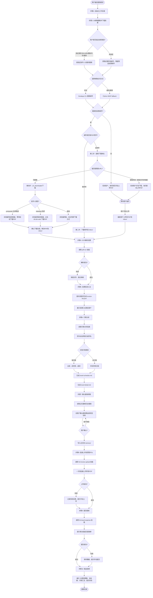

# 差旅费用报销流程图

## 步骤索引

| 步骤 | 名称 | 说明 |
|------|------|------|
| 1 | 初始化工作目录 | 创建 `run-{YYYYMMDD}-{序号}` 目录结构: inbox/, processed/, output/ |
| 2 | 搜索下载发票（四步流程） | **第一步**判断附件 → **第二步**下载附件 → **第三步**提取下载地址 → **第四步** url_downloader 下载 |
| 3 | 链接下载发票（废弃，合并至步骤2第四步） | 现已整合到步骤2的第四步 |
| 4 | OCR解析 | 调用 pdf-ocr 技能提取发票文字信息 |
| 5 | 发票汇总 | 生成 invoice-list.json，展示汇总表 |
| 6 | 行程分析 | 按行程分析指南识别行程，生成 travel-schedule.md 和 travel-detail.md |
| 7 | 确认参数 | 从记忆读取历史，确认报销事由和项目名称 |
| 8 | 上传发票 | 批量上传所有PDF到FOL财务系统 |
| 9 | 提交报销 | 按行程分段创建并提交差旅报销单 |
| 10 | 输出结果 | 展示报销处理结果 |

## 关键判断节点

- **第一步** 邮件无附件但也无法提取URL（按钮文字非链接）→ 告知用户手动从发件方官网/App下载
- **第四步** 链接下载失败（超时/需登录/验证码）→ 截图备用，告知用户，询问手动上传PDF
- **OCR解析失败** → 跳过该发票，继续处理其他
- **发票上传失败** → 记录失败，提示手动上传
- **报销提交失败** → 保存数据，提示手动提交
