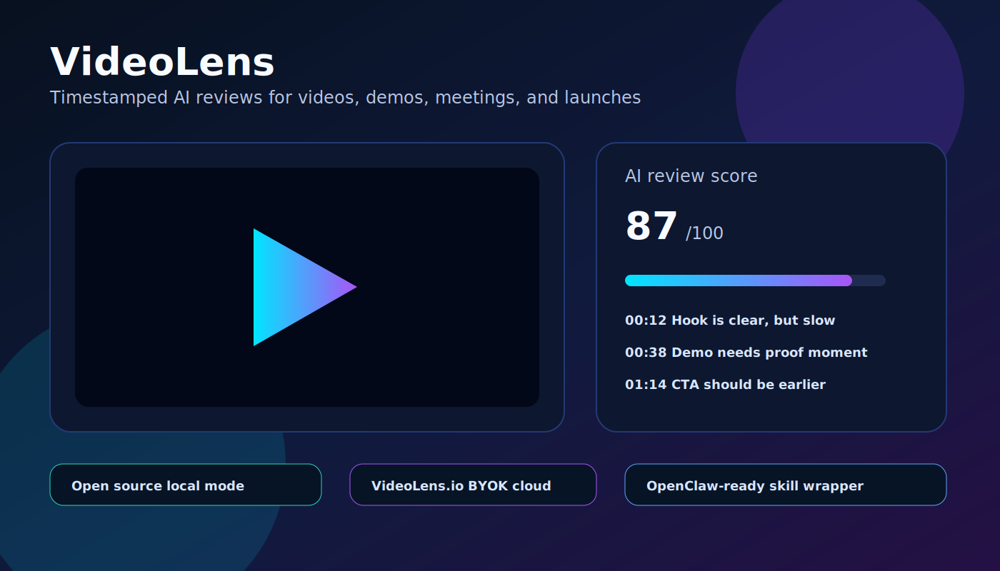
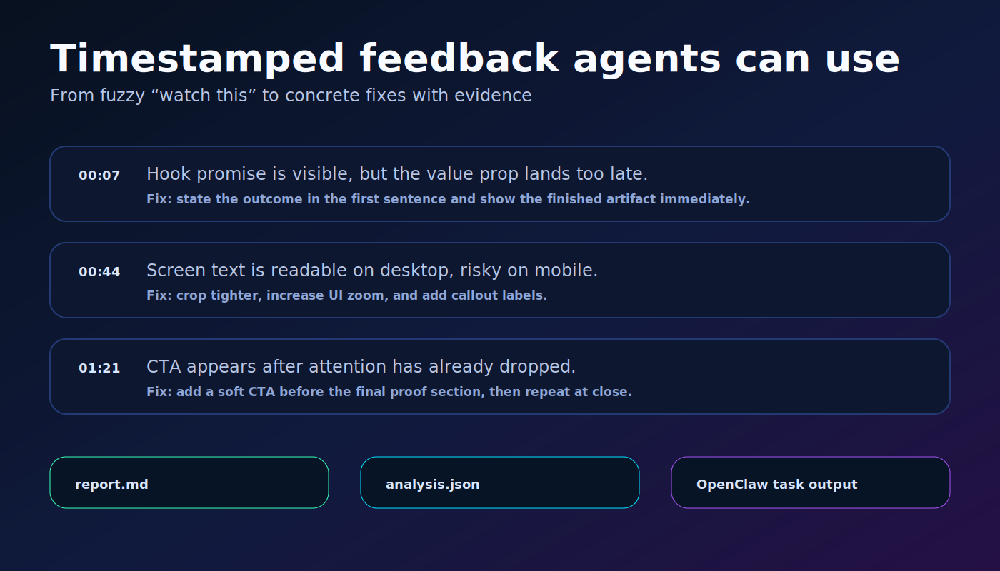
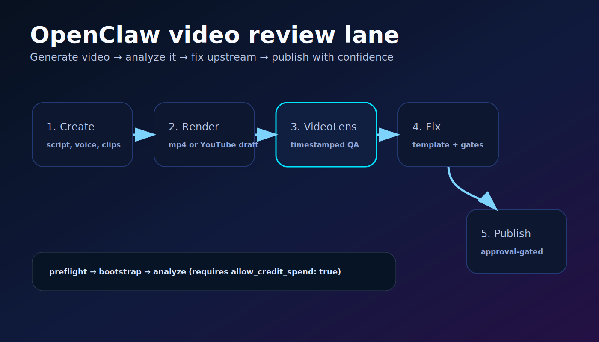

# 🎥 VideoLens.io

**AI video reviews from any prompt.** VideoLens watches your video and returns timestamped feedback: what works, what drags, what is unclear, what needs proof, and what to fix before publishing.

It is **open source**, works inside **OpenClaw**, and has a hosted **VideoLens.io cloud version** with **BYOK** for teams that want managed processing.



---

## What VideoLens does

Give VideoLens a video plus a review prompt. It returns a Markdown report and structured JSON your agents can use.

Use it for:

- **Creator video reviews:** hook, pacing, retention, clarity, narrative, CTA, title/thumbnail alignment.
- **Course and tutorial reviews:** whether a beginner can follow, where steps are missing, what needs a visual callout.
- **Sales/demo video reviews:** whether the viewer understands the promise, proof, and next action.
- **AI video pipeline QA:** catch weak openings, unreadable mobile text, abrupt endings, bad transitions, and missing proof before publishing.
- **Custom prompt reviews:** ask it to judge the video however your workflow needs.



---

## Why agents need this

Agents can write scripts, generate voice, render clips, and assemble videos. But before VideoLens, somebody still had to watch the draft.

VideoLens makes video review programmable:

1. Your agent renders a draft.
2. VideoLens reviews the actual video.
3. The report identifies timestamped issues.
4. OpenClaw can turn the feedback into fixes, gates, or a human review package.

If your agent can create video, it needs a second agent that can judge the video.

---

## OpenClaw integration

Install name: `videolens`

This package includes a manual-only OCC/OpenClaw local skill wrapper:

- `config.yaml` — local skill runner config
- `skill.py` — task runner entrypoint
- `SKILL.md` — OpenClaw/ClawHub instructions
- `assets/*.svg` — preview screenshots for ClawHub

OpenClaw task payloads live in `pre_instructions` as JSON or YAML. The skill supports:

- `preflight` — checks `git`, `ffmpeg`, `ffprobe`, runtime state, and keys
- `bootstrap` — clones the open-source VideoLens CLI and installs runtime
- `analyze` — runs video review and writes report artifacts

Guardrail: analysis requires `allow_credit_spend: true` so agents do not spend model credits by accident.



---

## Install

```bash
clawhub install videolens
```

Or from OpenClaw:

```bash
openclaw skills install videolens
```

---

## Quick start

### 1. Preflight

```json
{"action":"preflight"}
```

### 2. Bootstrap the open-source runtime

```json
{"action":"bootstrap"}
```

### 3. Review a video

```json
{
  "action": "analyze",
  "allow_credit_spend": true,
  "source": "https://youtu.be/YOUR_VIDEO_ID",
  "mode": "general",
  "prompt": "Review this video as a ruthless but constructive editor. Focus on hook, pacing, retention, clarity, proof, mobile readability, CTA, and top fixes before publishing.",
  "max_frames": 60,
  "frame_interval": 5.0
}
```

Outputs are written under the OCC data directory, typically:

```text
occ/data/videolens-video-intelligence/runs/<run-id>/report.md
occ/data/videolens-video-intelligence/runs/<run-id>/analysis.json
```

---

## Prompt examples

### YouTube / creator review

```text
Review this video like a ruthless but constructive YouTube editor. Focus on hook clarity, viewer promise, pacing, retention risks, mobile readability, jargon, proof, CTA, and whether the viewer knows what to do next.
```

### Tutorial review

```text
Review this tutorial for beginner clarity. Identify missing context, skipped steps, confusing visuals, points where the viewer may get lost, and concrete edits that would make the workflow easier to copy.
```

### Sales/demo review

```text
Review this demo as a conversion asset. Does it show the problem, proof, outcome, differentiation, and next step clearly? Give timestamped fixes ranked by likely conversion impact.
```

### AI pipeline QA

```text
Review this AI-generated video draft before publishing. Flag weak hooks, unreadable frames, abrupt transitions, bad endings, missing proof, confusing claims, and places where the script says something the visuals do not support.
```

---

## Open source + cloud

VideoLens is designed as both an **open-source agent skill** and a **cloud product**:

- **Open source:** run it yourself, inspect the workflow, wire it into OpenClaw, customize prompts, keep artifacts local.
- **Cloud BYOK:** use VideoLens.io when you want managed infrastructure, hosted reports, team workflows, and bring-your-own-key control.
- **Agent-native:** built for pipelines where Hermes/OpenClaw/Codex/Claude produce videos and need review before humans waste time or credits.

Cloud: https://videolens.io

Source: https://github.com/shadoprizm/videolens

---

## Requirements

- `OPENAI_API_KEY` for local/open-source analysis
- `git`
- `ffmpeg`
- `ffprobe`
- `uv` preferred, `python3` fallback
- optional `VIDEOLENS_CLOUD_API_KEY` for hosted VideoLens.io workflows

---

## Safety and privacy

- Local mode stores artifacts on your machine/OCC data directory.
- Cloud mode is optional and BYOK-oriented.
- The OpenClaw wrapper is manual-only by default.
- Credit-spending analysis requires explicit `allow_credit_spend: true`.
- Reports are Markdown/JSON so agents can audit and reuse them.

---

## License

MIT-0 on ClawHub. Build with it. Fork it. Wire it into your agents. Make better videos.
