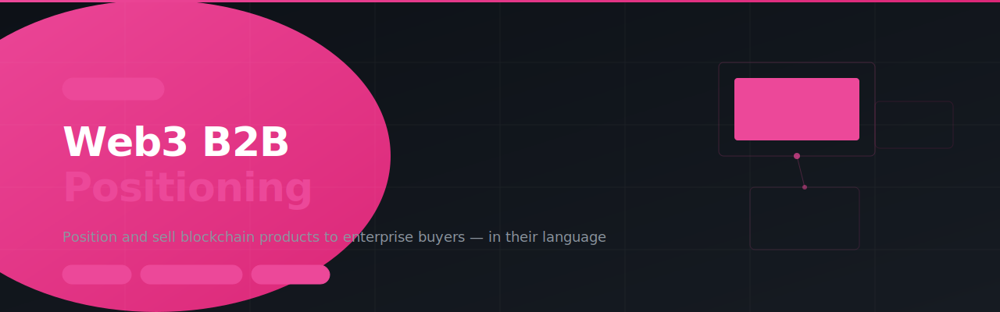

# web3-b2b-positioning



> SKILL.md for AI agents — Position and sell Web3 and blockchain products to enterprise buyers. Covers messaging frameworks, pitch collateral, jargon translation, objection handling, ICP definition, and trust-building assets.

---

## Install

```
clawhub skill install web3-b2b-positioning
```

Or paste the repo URL directly into your OpenClaw chat and the agent will install it automatically.

---

## What it does

6 modules, all in one skill:

| Module | What it solves |
| --- | --- |
| **Positioning Framework** | Feature-to-benefit matrix, positioning statements, and messaging hierarchy |
| **Sales Collateral** | One-pager structure and pitch deck flow optimized for enterprise |
| **Translation Layer** | Web3-to-business language dictionary and the "Explain it to a CFO" test |
| **Objection Handling** | Scripted responses to risk, compliance, IT, budget, and competitor objections |
| **ICP & Buyer Personas** | Ideal customer profile and 5-persona buyer map for enterprise deals |
| **Trust & Credibility** | Asset stack tiers and case study template for skeptical buyers |

---

## Who it's for

Web3 founders, protocol marketing leads, and blockchain solution sellers who need to bridge crypto-native products with traditional enterprise decision-makers.

---

## File structure

```
web3-b2b-positioning/
└── SKILL.md    ← Full skill (6 modules)
```

---

## Built with

- [OpenClaw](https://openclaw.ai)
- [ClawHub](https://clawhub.ai)

---

## License

MIT
