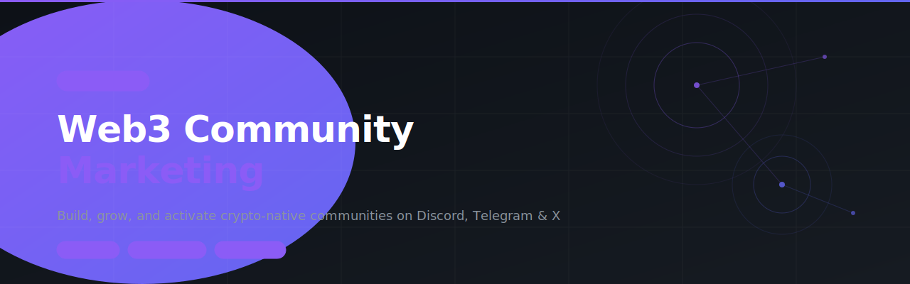

# web3-community-marketing



> SKILL.md for AI agents — Build, grow, and activate crypto-native communities on Discord, Telegram & X. Covers architecture, growth, engagement, developer communities, onboarding, and metrics.

---

## Install

```
clawhub skill install web3-community-marketing
```

Or paste the repo URL directly into your OpenClaw chat and the agent will install it automatically.

---

## What it does

6 modules, all in one skill:

| Module | What it solves |
| --- | --- |
| **Community Architecture** | Channel structure, platform selection, role design from scratch |
| **Growth & Acquisition** | Organic tactics for Discord, Telegram, Twitter/X, and partnerships |
| **Engagement Activation** | Revive silent communities with proven 3-week playbook |
| **Onboarding Flows** | 72-hour onboarding sequences that turn lurkers into contributors |
| **Developer Community** | Attract and retain builders — without marketing to them |
| **Metrics & Reporting** | Community health scorecard and weekly reporting templates |

---

## Who it's for

Protocol marketing leads, DAO contributors, Web3 founders, and community managers who treat community as a core growth lever — not a support function.

---

## File structure

```
web3-community-marketing/
└── SKILL.md    ← Full skill (6 modules)
```

---

## Built with

- [OpenClaw](https://openclaw.ai)
- [ClawHub](https://clawhub.ai)

---

## License

MIT
