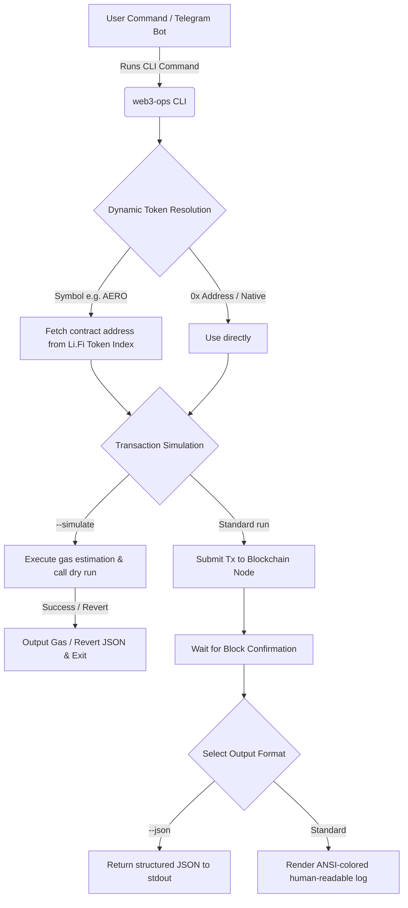

# OpenClaw Web3 Operations Skill

[](https://opensource.org/licenses/MIT)
[](#)
[](#)
[](#)


A **secure, non-custodial, AI-native Web3 operational skill with explicit execution safety** built with Node.js and Ethers.js v6. Designed for agentic workflows to execute wallet operations with client-side key isolation. It operates under a strict **Human-in-the-Loop** execution model, requiring explicit operator approval for any on-chain transaction.

---


## Key Features

### Advanced Trading & Security Features (New in v1.1.0)
*   **Wallet Generation (`create-wallet`)**: Generate a random EVM address, private key, and mnemonic locally. Automatically saves them to the `.env` file with secure overwrite protection.
*   **PnL Tracker (`pnl`)**: Automatically parses incoming/outgoing token transfers via Block Explorer APIs to compute the weighted average cost basis (Avg Buy Price) of your holdings. Compares this with real-time market prices from DexScreener to calculate net USD profit/loss (PnL) and percentage ROI.
*   **Cutloss & Takeprofit Monitor (`monitor`)**: Run active price monitoring in the foreground. Configurable with cutloss and takeprofit bounds (nominal USD or percentage-based). Executes a pre-authorized safety swap to USDC via the Li.Fi aggregator when price boundaries are crossed.
*   **Technical Trading Signals (`signal`)**: Fetches daily candle data (OHLCV) via the GeckoTerminal API to calculate **RSI (14)** and **EMA (20/50)** crossovers, returning trade recommendations (`STRONG BUY`, `BUY`, `NEUTRAL`, `SELL`, or `STRONG SELL`).
*   **Smart Contract Audit (`analyze`)**: Integrates GoPlus Security API to audit token contracts. Detects Honeypots, Buy/Sell taxes, Mintable supplies, Proxy configurations, and Ownership statuses to return a comprehensive security score.
*   **Whale tracker (`whales`)**: Scans recent block explorer token transfers to filter and detect transfers exceeding user-defined USD thresholds (default: $50,000).
*   **Anti-MEV Protection (`--anti-mev`)**: Routes transactions on supported networks (Ethereum, Polygon, BSC) through private RPC nodes (e.g. Flashbots Protect, BloXroute) to defend against sandwich attacks by searchers.
*   **Agent-Ready Alerts (`--alert`)**: Commands like `monitor`, `signal`, and `whales` support a `--alert` flag that embeds specific JSON alert payloads when targets are hit, enabling instant Telegram/Discord broadcast hooks.


### Core Features
*   **Dynamic Token Resolution**: No more manual contract address lookups. Enter symbols like `USDC`, `AERO`, or `PEPE` directly—the tool dynamically resolves them to their correct contract addresses on-the-fly via the Li.Fi indexer.
*   **Smart Portfolio Scan (`portfolio`)**: Automatically scans the wallet's transaction history via block explorer APIs (Etherscan, Basescan, etc.) to discover all active tokens with a balance (`balance > 0`). Perfect for tracking meme/degen coins automatically.
*   **Click-to-Copy Contract Addresses (CA)**: Lists contract addresses alongside token symbols. When combined with `--json`, it allows Telegram bots to format them inside backticks (e.g., `` `0x...` ``) for click-to-copy convenience.
*   **Transaction Simulation (`--simulate`)**: Performs an off-chain dry run using `estimateGas` and EVM simulation before broadcasting. Avoid wasted gas fees on reverting transactions!
*   **Multi-Bridge & Swap Routing**: Supports automatic best-route discovery via **Li.Fi Aggregator**, or manual routes via **Relay.link** (ultra-fast bridging), **Uniswap V3**, and **PancakeSwap V3**.
*   **AI Agent Friendly (`--json`)**: Appending `--json` silences all human-oriented logs and returns clean, structured JSON to `stdout` for reliable agent parsing.
*   **Broad Network Support**: Pre-configured support for Ethereum, Arbitrum, Base, Optimism, Polygon, BNB Chain, Avalanche, Linea, Scroll, zkSync, **Sonic (Mainnet)**, and **Berachain (Testnet)**, plus Sepolia and Base Sepolia testnets.
*   **RPC & Node Customization (`--rpc`)**: Override default public RPC nodes with custom private RPCs or testnet nodes dynamically on a per-command basis.
*   **Premium Terminal UI**: Outputs colored, readable CLI logs using ANSI color coding.

---

## 📐 Architecture Workflow

This diagram shows how a transaction flows from the CLI command (or Telegram user request) to its on-chain execution:



---

## 🛡️ Safety Model

To protect user assets and prevent common security concerns associated with blockchain-based agent tools, `web3-ops` operates under a strict safety specification:

*   **No Seed Phrase Handling**: The skill never requests, stores, or accesses mnemonics/seed phrases directly during active operations. 
*   **No Credential Collection**: Private keys are handled strictly within local volatile memory and are never transmitted over network endpoints, APIs, or AI provider systems.
*   **Explicit Transaction Confirmation**: Write actions (like transfers, swaps, bridges) require manual, explicit confirmation from the human operator before broadcasting.
*   **Human-in-the-Loop Execution**: The tool is engineered as a secure operational utility. The AI agent acts as a command generator and output parser, leaving execution authority with the human controller.

---

## 📋 Example Safe Workflows

The skill is designed for early-stage testing, basic Web3 exploration, and secure transaction simulation. Typical workflows include:

*   **Audit New Tokens**: Perform quick security checks on newly discovered token contract addresses to check for high taxes or honeypot risks.
*   **Track Portfolio Assets**: Inspect wallet balances and token holdings across multiple EVM networks simultaneously.
*   **Analyze Transferred Tokens**: Check transaction history and track recent asset interactions.
*   **Simulate Before Executing**: Test transactions off-chain (`--simulate`) to verify gas fees and confirm successful execution before broadcast.

---

## 🔒 Security, Threat Model & Permission Boundary


This skill is designed with a **Zero-Knowledge to LLM** architectural pattern to ensure the highest levels of security and confidentiality for your private keys and seed phrases:

*   **Zero-Knowledge to AI Agent (LLM)**: Remote AI Agents and Large Language Models (LLMs) **never** handle your private keys. The LLM only translates natural language into secure command-line parameters (e.g., `--chain`, `--to`, `--token`) and reads public `stdout` responses.
*   **Cryptographic Memory Isolation**: Transaction signing occurs strictly client-side within the local Node.js process runtime using `ethers.js`. Secrets are loaded only into volatile process memory and garbage-collected immediately upon command completion.

### 🛡️ Threat Model
*   **Access Limits**: The skill can **only** read its own directory, custom configuration variables from `.env`, and public blockchain information (RPCs, Explorer APIs, Price feeds).
*   **No Arbitrary Shell Execution**: The skill **does not execute any arbitrary commands or scripts** from inputs. Every user request maps strictly to predefined static functions using parameters parsed via `commander`.
*   **No Key Storage Persistence during operations**: The skill does not cache, database, or store keys in memory. The single write action occurs when the operator manually runs the local `create-wallet` command to write new credentials to the local `.env` file, protected by overwrite prevention.
*   **Non-Autonomous Loop**: The tool never executes unsolicited on-chain actions. Execution is entirely on-demand. Even the price `monitor` command runs in a foreground loop that can be exited safely via user cancellation (`Ctrl+C`).

### 📋 Permission Boundary Matrix

| Access Category | Permission Boundary | Rationale |
| :--- | :--- | :--- |
| **Read Access** | Read-Only Blockchain Queries | Fetching balances, contract security audits, transaction logs, and technical indicators. |
| **Write Access**| Optional Wallet Signing | Required **only** for broadcasting transactions (swap, bridge, mint, transfer). Falls back to read-only mode if no keys are set. |
| **Network Access**| Bounded Public APIs | Restricted strictly to the configured RPC endpoints, Block Explorers, DexScreener, GeckoTerminal, and GoPlus. |
| **System Access**| Local Directory Sandboxing | No write permissions requested outside the local project directory (except for writing newly generated wallet credentials to the local `.env` file during the `create-wallet` command). No system-level command execution. |


For the full detailed security specifications, contact info, and vulnerability reporting procedures, refer to the [SECURITY.md](SECURITY.md) policy document.

---

## 🚀 Quick Start & Installation

You can install this skill in three different ways depending on your preference:

### Opsi A: Automated NPX Installer (Recommended)
You can install this skill directly using our GitHub repository shorthand:
```bash
# Installs the latest version (v1.1.0 - Advanced Trading & Security)
npx github:perasyudha/skill-web3

# Installs the previous stable version (v1.0.1 - NFT & Sandboxing updates)
npx github:perasyudha/skill-web3#v1.0.1
```
*Note: If the package is published to the npm registry under `openclaw-web3-ops`, you can also use:*
```bash
npx openclaw-web3-ops
# Or for previous version:
npx openclaw-web3-ops@1.0.1
```
To install to a custom path instead of the default `~/.agents/skills/web3-ops`, pass the path as an argument:
```bash
npx github:perasyudha/skill-web3#v1.0.1 ./my-custom-path/web3-ops
```

### Opsi B: Conversational Install via AI Agent
If you are running an AI Agent (like Claude Code, Cursor, or OpenClaw) with terminal capabilities, simply paste the following prompt in the chat:
> *"Please install the web3-ops skill from https://github.com/perasyudha/skill-web3.git"*
The agent will automatically clone, setup the folder structure, and install dependencies.

### Opsi C: Manual Setup
Clone this repository and install the dependencies manually:
```bash
git clone https://github.com/perasyudha/skill-web3.git
cd skill-web3
npm install
```

### 2. Wallet Configuration

To process transactions, the AI Agent requires a dedicated cryptocurrency wallet. We strongly recommend creating a fresh, dedicated wallet (Burner Wallet) specifically for this bot.

Before starting, **ensure your terminal is inside the installation folder** by typing:
```bash
cd ~/.openclaw/plugin-skills/web3-ops
```

Choose one of the following setup methods:

**Option A: Auto-Generate Wallet (Highly Recommended 🔥)**
The easiest way! Simply run this command in your terminal:
```bash
node index.js create-wallet
```
The system will automatically generate a new wallet and securely store your *Private Key* in the `.env` file. *(Don't forget to write down the Mnemonic/Seed Phrase displayed on your screen!)*

**Option B: Import Existing Wallet (Manual)**
If you prefer to use an existing wallet (e.g., from MetaMask):
1. Open **File Explorer** (Windows), **Finder** (Mac), or **File Manager / Files** (Linux), and navigate to the `~/.openclaw/plugin-skills/web3-ops` folder. 
   *(Tip: On Linux/Mac, press `Ctrl+H` or `Cmd+Shift+.` to reveal hidden files).*
2. Rename the `.env.example` file to `.env`.
3. Open the `.env` file using a built-in app like **Notepad** (Windows), **TextEdit** (Mac), or **Text Editor / Nano** (Linux).
4. Remove the `#` symbol and insert your Private Key like this:
   `PRIVATE_KEY="0xYourPrivateKeyHere..."`
5. Save the file.

> **⚠️ SECURITY WARNING:** Never share your `.env` file or Private Key with anyone!

**Verify Your Setup:**
Run this command in the terminal to ensure your wallet is correctly connected:
```bash
node index.js address
```
If successful, your public wallet Address will be printed on the screen.

### 3. Private RPC Configuration (Optional but Recommended)

By default, this skill works out-of-the-box using free public connections. However, if your transactions frequently fail, process slowly, or you want to execute trades faster, we highly recommend setting up a **Private RPC**.

**How to set it up:**

1. Sign up for a free account at [Alchemy.com](https://www.alchemy.com/).
2. Create a new App (Select your desired network, e.g., *Base* or *Ethereum Mainnet*).
3. Copy the **HTTPS URL** from your *API Key* button.
4. Open **File Explorer** (Windows), **Finder** (Mac), or **File Manager** (Linux), and navigate to the `~/.openclaw/plugin-skills/web3-ops` folder.
   *(Tip: On Linux/Mac, press `Ctrl+H` or `Cmd+Shift+.` to reveal hidden files).*
5. Open your `.env` file using **Notepad** (Windows), **TextEdit** (Mac), or **Text Editor** (Linux).
6. Find the network line that matches your Alchemy App, and paste the URL inside the quotation marks.
   *Example for the Base network:* 
   `BASE_RPC_URL="https://base-mainnet.g.alchemy.com/v2/YOUR_API_KEY"`
7. Save the file.

Done! Your AI Agent will now automatically route transactions through this VIP/Private connection, ensuring maximum speed and reliability.

---

## 💻 CLI Commands & Examples

### Generate New EVM Wallet (create-wallet)
If you do not have an EVM wallet or want to generate a fresh one, run the `create-wallet` command. It will generate a random wallet and automatically write its credentials (`PRIVATE_KEY` and `MNEMONIC`) to your local `.env` file:
```bash
node index.js create-wallet
```
*Note: To prevent accidental loss of funds or keys, this command will immediately abort and refuse to run if it detects that you already have a wallet configured in `.env`. To force overwriting of existing keys, use the `--force` flag:*
```bash
node index.js create-wallet --force
```

### Get Wallet Address
Find out which wallet address is currently configured in the environment:
```bash
node index.js address
```

### Check Native/Token Balances
Check native coin balance on Arbitrum:
```bash
node index.js balance --chain arbitrum
```

Check a specific ERC-20 token (AERO on Base) using its symbol:
```bash
node index.js balance --chain base --token AERO
```

### Scan Portfolio (Auto-detecting Tokens)
Scan and list all tokens with a positive balance in your wallet. It automatically detects any bought "degen/micin" tokens using Basescan API and lists them with copyable Contract Addresses (CA):
```bash
node index.js portfolio --chain base
```
*Sample Visual Output:*
```text
==================================================
PORTFOLIO SUMMARY: Base
Address: 0x6152aBCde71F...
==================================================
ETH     :     0.024501
USDC    :   120.500000 (CA: 0x833589fCD6eDb6E08f4c7C32D4f71b54bdA02913)
AERO    :   415.000000 (CA: 0x940181a94A35A4569E4529A3CDfB74e38FD98631)
==================================================
```

### Transfer Coins/Tokens
Send `0.005 ETH` to a recipient on Base:
```bash
node index.js transfer --chain base --to 0x742d35Cc6634C0532925a3b844Bc454e4438f44e --amount 0.005
```

Send `50 USDC` to a recipient on Base:
```bash
node index.js transfer --chain base --to 0x742d35Cc6634C0532925a3b844Bc454e4438f44e --amount 50 --token USDC
```

### Swap Tokens (Same-Chain)
Swap `10 USDC` to `ETH` on Base using auto-routing (Li.Fi):
```bash
node index.js swap --chain base --fromToken USDC --toToken ETH --amount 10 --mode auto
```

Swap `50 USDC` to `WETH` on Base manually using **Uniswap V3** (simulate first to double-check):
```bash
node index.js swap --chain base --fromToken USDC --toToken WETH --amount 50 --mode manual --provider uniswap --simulate
```

### Bridge Tokens (Cross-Chain)
Bridge `0.01 ETH` from Arbitrum to `USDC` on Base using auto-routing:
```bash
node index.js bridge --fromChain arbitrum --toChain base --fromToken ETH --toToken USDC --amount 0.01 --mode auto
```

Bridge `0.05 ETH` from Optimism to `ETH` on Base manually using **Relay** (ultra-fast cross-chain routing):
```bash
node index.js bridge --fromChain optimism --toChain base --fromToken ETH --toToken ETH --amount 0.05 --mode manual --provider relay
```

### Mint NFT
Mint an NFT on Base by calling the `claim(address,uint256)` function with arguments:
```bash
node index.js mint --chain base --contract 0x123456789... --function "claim(address,uint256)" --args '["0xYourAddress", 1]' --value 0.00075
```

### Broadcast Custom Transaction
Send custom hex data to a smart contract:
```bash
node index.js custom --chain base --to 0xTargetAddress --data 0xa9059cbb000000000000000000000000742d35cc6634c0532925a3b844bc454e4438f44e0000000000000000000000000000000000000000000000000de0b6b3a7640000
```

---

## 📖 Real-World User-Agent Workflows & Demos


Below are standard interaction cycles showing how an AI Agent (e.g. OpenClaw) leverages the `web3-ops` skill under the hood to fulfill user requests safely and present natural-language responses.

### 1. Simple Read: "check ETH balance"
When a user asks to inspect their balance, the agent resolves the chain name and runs a read-only query.

```text
User  💬: "How much ETH do I have on Base?"

Agent 🤖 (Executing tool command):
$ node index.js balance --chain base --json

System Output 🖥️:
{
  "success": true,
  "chain": "Base",
  "address": "0x6152aBCde71F2bA7d863D5cE5e6629910c66F81b",
  "balance": "0.024501",
  "symbol": "ETH"
}

Agent 🤖 (Presented to User):
"You have 0.024501 ETH on Base in your configured wallet (0x6152...F81b)."
```

---

### 2. Smart Contract Audit: "audit contract AERO"
When a user queries the security status of an address, the agent uses the `analyze` command to audit the contract via GoPlus Security API before proposing any transaction.

```text
User  💬: "Audit the contract for AERO on Base, is it safe to buy?"

Agent 🤖 (Executing tool command):
$ node index.js analyze --chain base --token AERO --json

System Output 🖥️:
{
  "success": true,
  "tokenName": "Aerodrome",
  "symbol": "AERO",
  "address": "0x940181a94A35A4569E4529A3CDfB74e38FD98631",
  "securityScore": 90,
  "isHoneypot": false,
  "buyTax": 0,
  "sellTax": 0,
  "isProxy": false,
  "isMintable": true,
  "ownerRenounced": true,
  "risks": [
    {
      "severity": "LOW",
      "description": "Owner can mint additional tokens, causing potential dilution."
    }
  ]
}

Agent 🤖 (Presented to User):
"I've completed a smart contract audit for Aerodrome (AERO) on Base.
🛡️ Security Score: 90/100
- Honeypot: No (Selling is fully enabled)
- Trading Tax: 0% Buy / 0% Sell
- Proxy contract: No (Implementation cannot be altered)
- Owner: Renounced (No backdoors detected)

⚠️ Risk: The contract is mintable (dilution is possible). Overall, it is considered safe for normal trading."
```

---

### 3. Safe Swapping with MEV Protection: "swap 10 USDC to ETH on Base"
When a user initiates a transaction, the agent performs a transaction simulation and applies anti-MEV routing automatically to protect against frontrunning.

```text
User  💬: "Swap 10 USDC to ETH on Base. Protect me from MEV."

Agent 🤖 (Executing tool command):
$ node index.js swap --chain base --fromToken USDC --toToken ETH --amount 10 --anti-mev --json

System Output 🖥️:
{
  "success": true,
  "chain": "Base",
  "hash": "0x5d9b626e2e51927cb8ec775de6f78f8cb0865c404cfb92d6e3c49e29a1bcf88e",
  "from": "0x6152aBCde71F2bA7d863D5cE5e6629910c66F81b",
  "fromToken": "USDC",
  "toToken": "ETH",
  "amountIn": "10",
  "amountOut": "0.003185",
  "antiMevRouted": true
}

Agent 🤖 (Presented to User):
"Successfully swapped 10 USDC for 0.003185 ETH on Base. 
⚡ Transaction was routed securely through private RPC nodes to prevent sandwich/MEV attacks.
🔗 View transaction on Basescan: https://basescan.org/tx/0x5d9b626e2e51927cb8ec775de6f78f8cb0865c404cfb92d6e3c49e29a1bcf88e"
```

---

## 🤖 Integrator & AI Agent Options


### Structured JSON Output (`--json`)
AI agents and bots should always append `--json` to commands. All status messages are silenced, and only the final operation result is written to `stdout`.

*Example command:*
```bash
node index.js balance --chain base --token USDC --json
```

*Response:*
```json
{
  "success": true,
  "chain": "Base",
  "address": "0x6152aBCde71F...",
  "tokenAddress": "0x833589fCD6eDb6E08f4c7C32D4f71b54bdA02913",
  "tokenName": "USD Coin",
  "balance": "120.5",
  "symbol": "USDC"
}
```

### Dry Run Simulation (`--simulate`)
Use this flag to verify transactions off-chain first. The command runs gas estimation and code validation, returning gas costs:
```bash
node index.js transfer --chain base --to 0x742d35Cc6634C0532925a3b844Bc454e4438f44e --amount 10 --token USDC --simulate --json
```

*Response:*
```json
{
  "success": true,
  "simulated": true,
  "chain": "Base",
  "from": "0x6152aBCde71F...",
  "to": "0x742d35Cc6634C0532925a3b844Bc454e4438f44e",
  "amount": "10",
  "symbol": "USDC",
  "tokenAddress": "0x833589fCD6eDb6E08f4c7C32D4f71b54bdA02913",
  "estimatedGas": "57120"
}
```

---

## 🤖 AI Agent Integration Guide

To load this skill into your AI Agent framework, choose one of the following methods:

### Option A: Direct Installer (Recommended)
Simply run the installer directly in your terminal using the GitHub repository shorthand:
```bash
npx github:perasyudha/skill-web3
```
*(Or `npx openclaw-web3-ops` if it has been published to the npm registry).*
This automatically sets up the skill directory at `~/.agents/skills/web3-ops` and installs all dependencies in one command.

### Option B: Conversational / Agentic Setup
Ask your agent (e.g. Claude Code or OpenClaw Telegram Bot) to set it up:
> *"Please install the web3-ops skill from https://github.com/perasyudha/skill-web3.git"*

### Option C: Manual Setup
1. **Place the Skill Folder**: Clone this repository into your agent's skills directory (typically located at `~/.agents/skills/`):
   ```bash
   git clone https://github.com/perasyudha/skill-web3.git ~/.agents/skills/web3-ops
   ```

2. **Install Dependencies**: Navigate to the skill folder and install the required dependencies:
   ```bash
   cd ~/.agents/skills/web3-ops
   npm install --omit=dev
   ```

3. **Configure Environment Variables**: Open the main `.env` file of your agent project and configure the required keys:
   ```env
   PRIVATE_KEY="0x..." # The private key of your AI agent's EVM wallet
   
   # Optional: Explorer API Keys (highly recommended for auto-detecting custom/degen tokens in portfolio)
   BASESCAN_API_KEY="your_basescan_key"
   ETHERSCAN_API_KEY="your_etherscan_key"
   ```

4. **Enable Auto-loading**: Upon boot, the agent framework automatically parses the `SKILL.md` manifest in the skill folder. This configures the LLM (e.g. Gemini) to interpret user requests and call the corresponding CLI command dynamically.

## 🔌 Model Context Protocol (MCP) Integration

You can run this project as a local **Model Context Protocol (MCP) Server**, allowing AI clients like Claude Desktop, Cursor, or Zed to connect to your Web3 wallet and run queries or transactions as native tools.

### 1. Claude Desktop Configuration
Add the following configuration to your `claude_desktop_config.json` (located at `%APPDATA%\Claude\claude_desktop_config.json` on Windows or `~/Library/Application Support/Claude/claude_desktop_config.json` on macOS):

```json
{
  "mcpServers": {
    "web3-ops": {
      "command": "node",
      "args": ["c:/Users/PERASAYUDHA/Documents/Agent/mcp-server.js"],
      "env": {
        "PRIVATE_KEY": "your_private_key_here",
        "BASESCAN_API_KEY": "your_basescan_key",
        "ETHERSCAN_API_KEY": "your_etherscan_key"
      }
    }
  }
}
```

*Note: Since the server automatically loads `.env` variables from its local directory, you can also just leave the `env` config in `claude_desktop_config.json` empty if your `.env` file is already set up inside the `web3-ops` folder.*

### 2. Available MCP Tools
When connected, the client exposes the following tools to the LLM:
*   `get_address`: Get your configured wallet address.
*   `get_balance`: Check coin or ERC-20 token balance.
*   `scan_portfolio`: Scan wallet portfolio for active balances.
*   `transfer`: Send coins or ERC-20 tokens (with optional simulation & anti-MEV).
*   `swap`: Swap tokens on the same chain (with optional simulation & anti-MEV).
*   `bridge`: Bridge and swap tokens cross-chain.
*   `mint_nft`: Mint/claim NFTs via contract address or marketplace URL.
*   `custom_tx`: Broadcast custom raw transaction hex data.
*   `get_pnl`: Retrieve Profit & Loss stats for a token.
*   `analyze_contract`: Run smart contract audits via GoPlus API.
*   `get_trading_signal`: Get EMA crossover & RSI signal checks.
*   `track_whales`: Scan explorer transfers for whale activity.

---

## 💝 Support & Donation

If you find this skill useful and want to support its active development, donations are highly appreciated:

*   **EVM (Ethereum, Base, Arbitrum, Polygon, etc.)**: `0x18a30d5db50d287dba669c5672cd71246cc4c4c6`
*   **Solana**: `A6tSZZ5wJnTZewx6L5ZHa2Bgv7D2jWyFqwr1bM2AV777`

---

## 🛡️ License

This project is licensed under the MIT License - see the [LICENSE](LICENSE) file for details.
