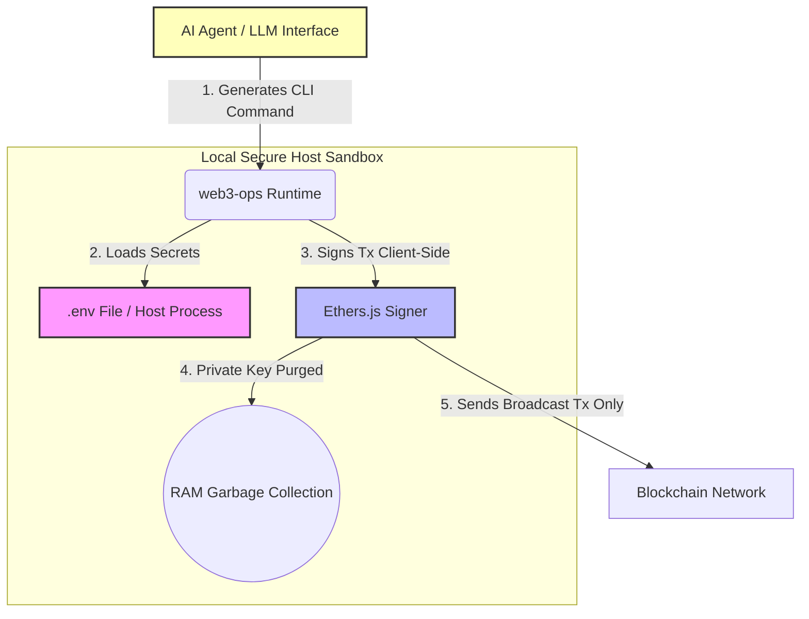

# Security Policy and Architecture

This document describes the security protocols, threat model, architectural safeguards, and vulnerability reporting procedures for the **OpenClaw Web3 Operations Skill** (`web3-ops`). 

As a non-custodial CLI tool and AI agent skill capable of executing blockchain transactions, security is our absolute design priority.

---

## 🔒 1. Cryptographic Key Management (Zero-Knowledge Architecture)

The `web3-ops` skill is engineered to ensure that your cryptographic keys (private keys or seed phrases) remain completely secure, private, and localized.

### Key Safeguards:
*   **Zero-Knowledge to AI Agent (LLM)**: Large Language Models (LLMs) and remote AI Agents interacting with this tool **never** see or handle your private keys or seed phrases. The LLM only generates CLI parameters (e.g., `--chain`, `--to`, `--token`) and reads public `stdout` results (e.g., transaction hashes, transaction statuses, and balances).
*   **Local-First Transaction Signing**: All cryptographic operations, key derivation, and transaction signing occur strictly client-side within the local Node.js runtime memory using `ethers.js`. Keys are never sent to third-party endpoints, proxy servers, or LLM providers.
*   **Volatile In-Memory Lifecycle**: Your private keys are loaded into system memory only during command execution and are instantly purged when the process terminates. No keys are cached or written to local log files.

---

## 🛡️ 2. Threat Model & Permission Boundaries

To ensure developer and operator confidence, we explicitly define the access limits, capabilities, and system requirements of the `web3-ops` execution loop:

### A. Skill Capabilities & Limits Matrix

| Parameter | Capability / Status | Technical Implementation Detail |
| :--- | :--- | :--- |
| **Can Access** | **YES** | Local `.env` file, blockchain RPC nodes, and public price/security APIs (DexScreener, GeckoTerminal, GoPlus). |
| **Cannot Access** | **NO** | Host filesystem outside the project directory, system settings, user credentials, or other system environment variables. |
| **Execute Shell** | **NO** | The skill does **not** execute arbitrary shell commands. It does not run scripts, compile external code, or invoke shell interpreters (`sh`, `bash`, `cmd`). It maps strict input arguments to predefined static functions using the `commander` package. |
| **Sign Transactions** | **YES** | The skill signs transaction payloads locally in memory using `ethers.js` via the configured wallet. It only broadcasts signed payloads to public or private RPCs. |
| **Store Keys** | **NO / LOCAL ONLY** | The skill has **zero key storage persistence during operations**. It does not cache keys in memory or database them. The only write action is when the operator manually runs the `create-wallet` command to write new credentials to the local `.env` file. This action is protected by strict overwrite prevention. |
| **Autonomous** | **NO** | The skill is **not autonomous**. It only executes on-demand when called via the CLI. Even the pricing `monitor` command runs in a synchronous, foreground loop started explicitly by the operator and terminates gracefully upon hitting limits or on user cancel (`Ctrl+C`). |

### B. Explicit Permission Boundaries

When integrating this skill into an AI Agent framework, the required system permissions are strictly bounded:

> [!IMPORTANT]
> ### Required Permission Boundary:
> 1. **Read-Only Blockchain Access**: Enabled by default to fetch native/token balances, resolve token contract addresses, fetch pricing data, track transactions, and perform GoPlus contract audits.
> 2. **Optional Wallet Signing (Write Access)**: Only requested when executing transaction commands (`transfer`, `swap`, `bridge`, `mint`, `custom`, and `monitor` when limits are breached). If the `PRIVATE_KEY` is not provided, the skill automatically falls back to read-only mode for query-based commands.
> 3. **No Private Key Persistence**: The skill operates under a strict memory-only lifecycle. No local databases, state files, or cookies are used to retain credentials.
> 4. **Outbound Network Access**: Bounded strictly to:
>    * Blockchain JSON-RPC endpoints (e.g., private anti-MEV RPCs, public Infura/Alchemy/Ankr nodes).
>    * Public Web3 services: GeckoTerminal API, DexScreener API, GoPlus Security API, Li.Fi Aggregator API.
> 5. **Wallet Generation Isolation**: The `create-wallet` tool is **excluded from the MCP server tool list**. It can only be executed directly via the local terminal CLI, ensuring that private keys/mnemonics are never transmitted over network contexts to LLM providers during generation.

---

## 🛡️ 3. On-Chain Security Features

To protect your assets from common on-chain exploits (such as malicious smart contracts or sandwich attacks), `web3-ops` includes built-in protective features:

### A. Smart Contract Audit Integration (`analyze`)
Before interacting with any new or untrusted token, users or AI agents can invoke the `analyze` command:
*   **GoPlus Security API**: Checks the target token address across 30+ threat indicators.
*   **Threat Indicators Analyzed**:
    *   **Honeypot Risk**: Checks if selling is restricted or if the contract has blacklist/whitelist functions.
    *   **Tax Structure**: Detects unusually high buy/sell transfer taxes.
    *   **Access Control**: Warns if the contract is mintable, has owner-backdoors, or has not renounced ownership.
    *   **Proxy Contracts**: Highlights if the implementation can be upgraded maliciously.

### B. Anti-MEV (Maximal Extractable Value) Protection (`--anti-mev`)
To avoid being frontrun or sandwiched on public mempools, you can append the `--anti-mev` flag to your transactions:
*   **Private Mempool Routing**: Instead of broadcasting to public RPCs, the tool routes transactions directly to MEV-resistant private block builders (e.g., Flashbots Protect on Ethereum, bloXroute, or private builders on BNB Chain).
*   **Zero Slippage Exploitation**: By bypassing the public mempool, searcher bots cannot detect your swap or sandwich your trade.

### C. Transaction Simulation (`--simulate`)
Before broadcasting transactions, the `--simulate` option simulates the execution using `estimateGas` and dry-run calls against the current state of the blockchain.
*   Prevents wasting transaction gas on failing transactions.
*   Identifies contract reverts prior to broadcasting.

---

## ⚙️ 4. Security Hardening Best Practices

If you are running this tool in production or exposing it to an AI Agent, we strongly recommend following these hardening guidelines:

| Category | Best Practice | Rationale |
| :--- | :--- | :--- |
| **Wallet Setup** | Use a dedicated **Hot Wallet** containing only the assets required for immediate operations. | Minimizes the blast radius in case the host machine is compromised. |
| **Permissions** | Set restrictive permissions on the `.env` file containing your keys (e.g., `chmod 600 .env` on Unix-like environments). | Prevents unauthorized local users from reading your credentials. |
| **Private RPCs** | Configure custom private RPC endpoints using the `--rpc` option. | Enhances network reliability, reduces rate limits, and improves privacy. |
| **Environment Separation**| Run the AI Agent and the `web3-ops` execution environment in a sandboxed or containerized environment (e.g., Docker). | Restricts the LLM's system access and prevents path traversal to the `.env` file. |

---

## 🐛 5. Reporting Vulnerabilities

If you discover a security vulnerability in this project, please report it to us immediately. **Do not open a public GitHub issue for security bugs.**

### Reporting Process:
1.  Send a detailed description of the vulnerability directly to the project maintainer via safe/private channels.
2.  Include a proof of concept (PoC) or step-by-step instructions to reproduce the issue.
3.  We will acknowledge receipt of your report within **24 hours** and provide a status update on a fix within **72 hours**.

### Responsible Disclosure Guidelines:
We ask you to follow responsible disclosure guidelines:
*   Allow us reasonable time to investigate and remediate the issue before publishing any information about it.
*   Do not attempt to exploit the vulnerability or access user funds.
*   Do not perform denial-of-service (DoS) attacks or run automated stress-testing scanners against public infrastructure.

---

## 📜 6. Disclaimer

*This software is provided "as is", without warranty of any kind, express or implied, including but not limited to the warranties of merchantability, fitness for a particular purpose, and noninfringement. In no event shall the authors or copyright holders be liable for any claim, damages, or other liability, whether in an action of contract, tort, or otherwise, arising from, out of, or in connection with the software or the use or other dealings in the software.*

