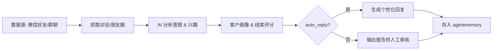

# WeChat Lead Generation 技能

> 自动抓取微信联系人/群聊数据，AI 分析潜在客户意向，智能生成个性化回复

## 核心功能

- **🔍 多渠道抓取** - 支持微信好友、群聊、朋友圈、公众号文章抓取
- **🧠 智能分析** - 基于对话内容识别客户兴趣、购买意向、客户画像
- **🤖 自动回复** - 根据客户画像生成个性化跟进话术
- **💾 线索存储** - 自动存入 agentmemory，支持长期追踪与评分

## 适用场景

- 销售团队自动跟进潜在客户
- 社群运营自动化互动
- 微商/电商客户转化
- 产品推广线索收集

## 输入参数

| 参数 | 类型 | 必填 | 说明 |
|------|------|------|------|
| `source` | string | ✅ | 数据来源：`friends`/`groups`/`moments`/`articles` |
| `days_back` | int | ⭕ | 抓取最近 N 天数据（默认 7） |
| `keywords` | array | ⭕ | 过滤关键词（如 "AI"、"机器人"）|
| `analysis_depth` | enum | ⭕ | 分析深度：`basic`/`detailed`/`deep` |
| `auto_reply` | bool | ⭕ | 是否自动生成回复（默认 false）|
| `reply_template` | string | ⭕ | 回复模板（变量：{name}, {interest}, {product}）|

## 输出产物

- **线索报告** (`leads-report.md`) - 潜在客户列表 + 评分
- **客户画像** (`artifacts/profiles.json`) - 分析结果 JSON
- **自动回复** (`artifacts/replies.md`) - 待发送的回复草稿
- **记忆存储** - 客户数据存入向量数据库

## 工作流



## 使用示例

### 抓取并分析群聊潜在客户

```bash
# 基础分析（不自动回复）
wechat-lead-generation --source groups --days_back 3 --keywords "AI,chatbot" --analysis_depth detailed

# 完整流程（自动生成回复）
wechat-lead-generation \
  --source friends \
  --days_back 7 \
  --analysis_depth deep \
  --auto_reply true \
  --reply_template "你好{name}，注意到你对{interest}感兴趣，我们的{product}可能适合你，..."
```

### 定时任务

每天早上 9:00 自动扫描新线索：

```bash
openclaw cron add \
  --name "微信线索自动扫描" \
  --schedule "0 9 * * *" \
  --payload.agentTurn.message "用 wechat-lead-generation 抓取今天群聊中的 AI 相关线索，分析深度 detailed，生成报告但不自动回复" \
  --delivery.announce.channel openclaw-weixin
```

## 配置依赖

### 必需技能

- `wechat-md-publish` 或 `bb-browser-openclaw` - 微信数据抓取
- `trendradar` - 行业热点关联（可选）
- `agentmemory` - 客户画像存储

### 环境变量

```bash
# 如果使用 wechat-md-publish 需要配置微信 cookie
WECHAT_COOKIE="your_wechat_cookie_here"

# 如需自动回复（谨慎使用，避免封号）
AUTO_REPLY_ENABLED=true
```

## 风险与合规

⚠️ **重要提示**：

- 微信自动抓取和自动回复可能违反微信用户协议
- 建议使用 **半自动模式**（生成回复草稿供人工审核）
- 避免高频操作（建议间隔 > 30 秒）
- 仅用于合法合规的客户跟进场景
- 用户需自行承担使用风险

## 输出结构

```
output/wechat-lead-generation/
├── leads-report-20260526.md          # 线索汇总报告
├── artifacts/
│   ├── profiles.json                 # 客户画像数据
│   ├── high_score_leads.json         # 高评分线索（>80分）
│   ├── replies.md                    # 自动回复草稿
│   └── raw_messages.json             # 原始抓取数据
```

## 评分算法

线索评分（0-100）基于：

| 维度 | 权重 | 说明 |
|------|------|------|
| **关键词匹配** | 30% | 对话中出现产品相关关键词 |
| **互动频率** | 25% | 与你的消息互动次数 |
| **兴趣强度** | 25% | 主动询问、表达购买意向 |
| **最近联系** | 20% | 时间越近分数越高 |

## Troubleshooting

### 抓取失败

- 检查微信 cookie 是否有效
- 确认 `wechat-md-publish` 已安装并配置
- 降低抓取频率，避免触发风控

### 生成回复质量低

- 增加 `--analysis_depth deep`
- 提供更多上下文数据（更多天历史）
- 自定义 `--reply_template` 包含个性化字段

### 被封号风险

- 启用 `--auto_reply false` 转为人工审核模式
- 设置 cron 任务间隔至少 4 小时一次
- 使用真实微信号（非小号）并保持合理频率

## License

MIT © Chace
