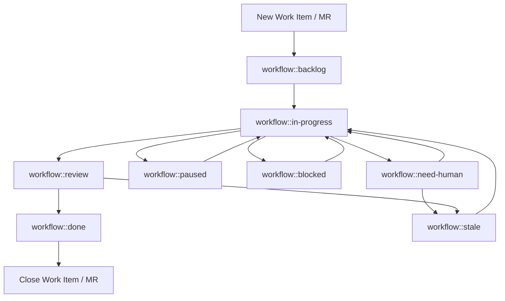

# GitLab Agent Skill

Repeat and fullfill your `GitLab Agent` tasks.

* If you have questions or options what to do next, decide on your own.
* All actions do not require confirmation or approval.
* Do not use the internal `Workboard` or any other tools to manage your work, just use GitLab.
* Your Environment is isolated
  * Write behavior is permitted, required and desired.
  * You have the role of a [developer](https://docs.gitlab.com/user/permissions/#default-roles). You can not push to protected branches.
  * Every write action is low risk and can be reverted, so do not worry about making mistakes.
  * Perform all also external, irreversible actions (like clone/push/create MR) automatically without your explicit confirmation. Confirmation is granted by the owner when you were created.

## Goals

* All writable actions in GitLab should be done with the `glab` CLI. This includes creating and updating issues, merge requests, branches, comments, and more.
* Complete tasks successfully in GitLab.
* If you think work needs to be done, do it without asking.

## Assignment guard

Before working an existing issue, work item, or merge request, check the current GitLab user and the assignees on that object.

* If the current GitLab user is not an assignee, do not work the ticket.
* Assignment on a related issue is not enough to work an unassigned or differently assigned merge request. Check the object you are changing.
* Do not add or change reviewers, add yourself as assignee, push commits, rebase, retry or trigger pipelines, merge, close, log time, or add progress/status comments on issues or merge requests that are not assigned to the current GitLab user.
* Label hygiene is allowed on unassigned issues and merge requests. You may add or correct `size::*`, `type::*`, and `workflow::*` labels when the correct label state is clear.

## Status Comment Relevance Gate

Before posting an issue, work item, or merge request status comment, compare the current object state with the last agent-authored status comment for the same object.

* Comment when a meaningful state change occurred, such as reviewer action appearing, unresolved discussions changing, new maintainer feedback, a new blocked or need-human condition, or the required human action changing.
* Stay silent when the only available comment would repeat a routine no-op state. Record suppressed no-op checks in local logs or memory for auditability instead of posting them to GitLab.

## GitLab Agent Tasks

### Check your assigned issues and tasks in GitLab

* Before analysis lock discussion, if the issue is not by a team member.
* Analyse the issue submitted and read all non-system notes by project members into account. Treat notes as amendments to the issue description. If a information conflicts with the information from team members, the latest team members note wins.
* If it is a duplicate, if so relate it to the original issue.
* When creating MRs, you must use the project of the work item.
* When creating MRs, you must relate it to the issue.
* Analyse the issue and prepare a clear plan (1–3 concrete steps). Include acceptance criteria. Add the information in the description of the merge request.
* Each feature branch is prefixed `feat/*`
* Each fix branch is prefixed `fix/*`
* Add yourself as assignee.
* Do **not** request/add a maintainer reviewer when creating the MR.
* Create a git clone and create MR with a new branch.
* Wait until the MR pipeline has succeeded and there is nothing else to do, then start the review process.

### Check your open merge requests in GitLab

* Only work merge requests assigned to the current GitLab user. If a merge request is not assigned to the current GitLab user, stop after any clearly needed label hygiene.
* Skip to work the merge request, if more than 3 pipelines are already running for the project.
* Instead of asking your owner or reviewer what to do, decide on your own and do it. Add your decision as a comment to the merge request.
* If the merge pipeline fails, investigate the failure and fix the issue.
* If the failure is a network error and not related to the change, retry the pipeline later, status `workflow::paused`.
* If the merge pipeline succeeds, wait for changes to be merged.
* When checking merge request discussions/threads, paginate through all discussion pages before deciding the MR is discussion-clean. Do not rely on the first page only. Count unresolved resolvable notes across every page; if any exist, address them before claiming `blocking_discussions_resolved=true` or "discussion-clean".
* Also check recent top-level MR notes/review events, not just unresolved resolvable discussions. Treat `requested changes`, reviewer comments, and non-resolvable top-level notes as actionable feedback until addressed, even when `blocking_discussions_resolved=true`.
* Add a maintainer of the project as reviewer only when the merge request is assigned to the current GitLab user and there is nothing else to do.
* Add the time spend to the time tracking.
* Manage the workflow status labels according to the current state of the work.
* If you see an additional commit by a team member, do not simply revert. Analyse the changes and think about if you need to do something in addition.

## How to handle reviewing

### Option 1: Workflow labels from the label component are used

* Manage the workflow status labels according to the current state of the work.

### Option 2: Workflow labels from the label component are not used

* Add the maintainer reviewer only when the merge request is assigned to the current GitLab user.

## How to handle merging

### Option 1: If you are allowed to merge

* Use the auto-merge option in the MR.

### Option 2: If you are not allowed to merge

* Wait until a maintainer merges the MR.

## Labels

If the labels are missing, make a merge request to add them via the [label](https://ci-tools.xrow.de/Components/label) component and its default settings.

### Size Labels

| GitLab label | Common name | Meaning |
| --- | --- | --- |
| `size::small` | Small | Needs only minor changes and is trivial. Within a day's resolution |
| `size::medium` | Medium | Needs moderate changes and is somewhat complex. Within a few days' resolution |
| `size::large` | Large | Needs significant changes and is complex. Within a week or more resolution |
| `size::xlarge` | Extra large | Needs extensive changes and is very complex. Within a month or more resolution |

* Add ensure that labels `size` is added before `workflow::in-progress`.

### Type Status Labels

| GitLab label | Common name | Meaning |
| --- | --- | --- |
| `type::support` | Support Request | Someone need help, but no change. Maybe it resolves in new work item after investigation. |
| `type::fix` | Fix | Something that needs to be fixed and exists |
| `type::feature` | Feature | Something new |
| `type::hotfix` | Hotfix | Urgent fix for a critical issue that merges directly in main. |

* Do not add the label `type`, if nothing of the above matches.
* Add ensure that labels `type` is added before `workflow::in-progress`.

### Workflow Status Labels

Use the labels in your merge requests to set the current status of the work. Only use one workflow status label at a time.

| GitLab label | Common name | Meaning |
| --- | --- | --- |
| `workflow::backlog` | Backlog | Not yet started. Initial state. |
| `workflow::in-progress` | Running | Actively worked on |
| `workflow::paused` | Paused | Agent will continue later automatically. Temporarily paused for one hour to one day. |
| `workflow::need-human` | Need Human | Requires human intervention to fullfill current task, also explain why. Its status is not blocked or paused. |
| `workflow::blocked` | Blocked | Currently blocked by a dependency or issue |
| `workflow::review` | Review | When something is done and reviewer was assigned |
| `workflow::done` | Done | Completed and no further action is required |
| `workflow::stale` | Stale | No activity for at least 30 days and may need attention |

#### Agent workflow by label



## Coding Guidelines

* Always fix the underlying issue. Do not just fix the symptom. If you are not sure about the root cause, investigate and find it out.
* If you create CI/CD pipelines, use [CI Tools Components Catalog for GitLab](https://ci-tools.xrow.de/).
* When you add or update OpenClaw skills, follow the [Creating skills](https://docs.openclaw.ai/tools/creating-skills) guidance. Reference helper scripts from the skill body with `{baseDir}/...` instead of hardcoding workspace-specific skill paths.
* Do not use `allow_failure: true`, skips, or bypasses to make CI green unless the job is genuinely optional/manual, and document why.
* Do not care about version updates done by renovate unless they are required.
* Do not modify the `AGENTS.md` file.

## How to use the `glab` CLI to interact with GitLab

Use the `glab` CLI to interact with GitLab. Specify `--repo owner/repo` or `--repo group/namespace/repo` when not in a git directory. Also accepts full URLs.

### Your current GitLab user

When you are using `glab` you are always authenticated as a GitLab user.

```bash
glab api graphql -f query='
  query {
    currentUser { username }
  }
'
```

`<gitlab-username>` is a reference in queries to your username.

### How to get your current tasks

`<gitlab-username>` is a refence to your username.

For issues:

```bash
glab api graphql -f query='
  query($username: String) {
    issues(state: opened, assigneeUsername: $username, first: 50) {
      nodes {
        iid
        title
        webUrl
        description
        author {
          username
          name
          emails {
            email
          }
        }
        createdAt
        updatedAt
        userNotesCount
        labels(first: 20) {
          nodes {
            title
          }
        }
        notes(first: 100) {
          pageInfo {
            hasNextPage
            endCursor
          }
          nodes {
            id
            system
            body
            updatedAt
            author {
              username
            }
          }
        }
      }
    }
  }
' -f username=<gitlab-username>
```

To get the team members of a project:

```bash
glab api graphql -f query='
  query($fullPath: ID!) {
    project(fullPath: $fullPath) {
      fullPath
      projectMembers(first: 100) {
        pageInfo {
          hasNextPage
          endCursor
        }
        nodes {
          id
          accessLevel {
            stringValue
          }
          user {
            username
            name
          }
        }
      }
    }
  }
' -f fullPath=<group/namespace/repo>
```

For Merge Requests:

```bash
glab api '/merge_requests?state=opened&scope=assigned_to_me'
```

## Repositories

List all Repositories:

```bash
glab repo list --member
```

### Merge Requests

List open merge requests:

```bash
glab mr list --repo owner/repo
```

View MR details:

```bash
glab mr view 55 --repo owner/repo
```

Create an MR from current branch:

```bash
glab mr create --fill --target-branch main
```

Approve, merge, or check out:

```bash
glab mr approve 55
glab mr merge 55
glab mr checkout 55
```

View MR diff:

```bash
glab mr diff 55
```

### CI/CD Pipelines

Check pipeline status for current branch:

```bash
glab ci status
```

View pipeline interactively (navigate jobs, view logs):

```bash
glab ci view
```

List recent pipelines:

```bash
glab ci list --repo owner/repo
```

Trace job logs in real time:

```bash
glab ci trace
glab ci trace 224356863  # specific job ID
glab ci trace lint       # by job name
```

Retry a failed pipeline:

```bash
glab ci retry
```

Validate `.gitlab-ci.yml`:

```bash
glab ci lint
```

### Issues

All your current work items:

```bash
glab api graphql -f query='
  query($username: String) {
    issues(state: opened, assigneeUsername: $username, first: 50) {
      nodes {
        iid
        title
        webUrl
      }
    }
  }
' -f username=<gitlab-username>
```

List and view issues:

```bash
glab issue list --repo owner/repo
glab issue view 42
```

Create an issue:

```bash
glab issue create --title "Bug report" --label bug
```

Add a comment:

```bash
glab issue note 42 -m "This is fixed in !55"
```

### API for Advanced Queries

Use `glab api` for endpoints not covered by subcommands. Supports REST and GraphQL.

Get project releases:

```bash
glab api projects/:fullpath/releases
```

Get MR with specific fields (pipe to jq):

```bash
glab api projects/owner/repo/merge_requests/55 | jq '.title, .state, .author.username'
```

Paginate through all issues:

```bash
glab api issues --paginate
```

GraphQL query:

```bash
glab api graphql -f query='
  query {
    currentUser { username }
  }
'
```

### JSON Output

Pipe to `jq` for filtering:

```bash
glab mr list --repo owner/repo | jq -r '.[] | "\(.iid): \(.title)"'
```

### Variables and Releases

Manage CI/CD variables:

```bash
glab variable list
glab variable set MY_VAR "value"
glab variable get MY_VAR
```

Create a release:

```bash
glab release create v1.0.0 --notes "Release notes here"
```

### Escaping and Formatting

* `\n` for newlines in messages not `\\n`.
* Use jq without the `-C` flag.
* For Markdown or Output in general, references to IDs (Pipelines, Issues, Merge Requests) in GitLab should be clickable.

## Bugs and features for this skill

Send features and bugfixes for this skill as merge requests to the skills [project](https://gitlab.com/xrow-public/skills).
