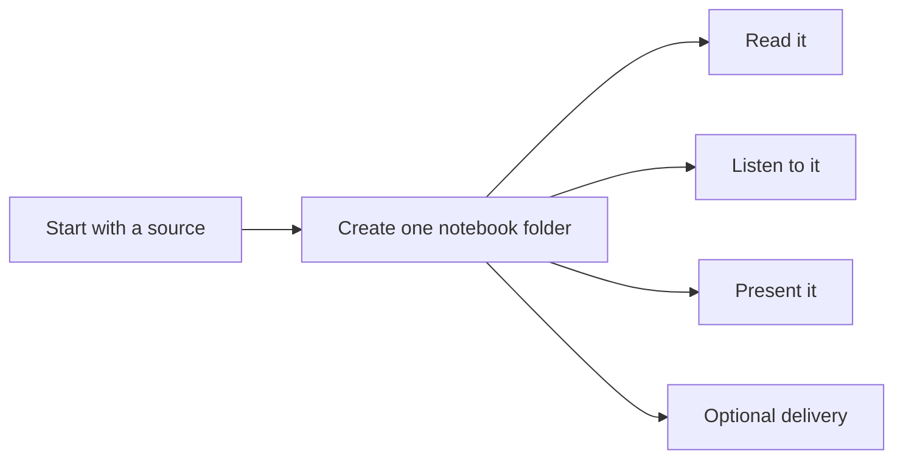

# yumnb — Yum NoteBook

[](https://github.com/yumyumtum/yumnb/releases)
[](https://clawhub.ai/skills/yumnb)
[](LICENSE)

> **A local-first NotebookLM alternative for AI agents, built for real source capture.**
>
> Turn any URL, YouTube video, screenshot, or chunk of text into a tidy
> learning packet: **AI summary + dual-host talk-show MP3 + slide deck**,
> with optional webhook notification and direct IM delivery via OpenClaw / Hermes.



## Why

LLMs are great at digesting one thing at a time but rarely leave behind a
clean, reusable notebook. yumnb fixes that by turning each request into a
**filesystem-first notebook folder** with notes, audio, slides, and a small
manifest.

A big part of that is **reliable source extraction**. A notebook workflow is
only as good as the source it can actually pull in. yumnb puts real effort
into getting the source material locally first, instead of assuming every web
page or YouTube URL will behave nicely.

The core model is simple: **one user request = one notebook folder**.
That folder holds the source material plus everything generated from it. Over
time, many such folders naturally become a local knowledge base you can read,
search, narrate, present, version, and reuse.

If you like the idea of NotebookLM but want a more local-first, file-based
workflow, yumnb is a good fit. It is not trying to copy NotebookLM exactly;
it is a polite alternative for people who prefer to keep their notebooks,
source material, and generated artifacts on their own machine by default.

## How people use yumnb

Usually an AI agent runs yumnb for you.

You start with a source — for example a YouTube link, an article, a
screenshot, or a block of text — and yumnb turns that into a notebook folder
under your chosen `output_dir`.

A typical path looks like:

```text
output/yumnb/20260525-1242-top-1-opportunity-for-senior/
```

Inside that folder you get the source material, the written notebook, the
spoken recap, and the slide deck.

## Source extraction matters

A lot of notebook-style tools look great until the source fetch fails.
That is especially common with:

- web pages that return thin HTML, partial HTML, or JS-heavy shells
- pages with light blocking / anti-bot behavior
- YouTube videos where transcript availability is inconsistent

`yumnb` is designed to be more stubborn about source capture:

- for **YouTube**, it tries manual subtitles first, then auto subtitles, then
  `youtube-transcript-api`, then finally falls back to description-only if it
  has to
- for **web pages**, it extracts readable text locally and also lets you plug
  in your own fetcher when plain requests is not enough
- the extracted source is kept in the notebook folder, so you can inspect what
  was actually captured instead of guessing what the tool saw

That matters because even strong hosted notebook products can fail on perfectly
reasonable web URLs. yumnb’s goal is not to promise magic, but to make source
extraction **more transparent, more recoverable, and less fragile**.

## Privacy / data handling

By default, yumnb is local-first:

- it only works on sources you explicitly give it
- it stores notebooks as normal local files under your chosen output folder
- it does **not** upload, sync, notify, or deliver anything unless you
  explicitly enable those features in config
- it does **not** need a hosted notebook service to keep your notes organized

If you enable an external AI provider, TTS service, cloud upload, webhook, or
OpenClaw/Hermes delivery, then those specific integrations will be used. But
that is opt-in, not the default behavior.

## At a glance

| If you want to… | yumnb gives you… |
| --- | --- |
| Turn a video/article into study notes | `summary.md` |
| Get an audio recap | `talkshow.txt` + `talkshow.mp3` |
| Drop the result into a meeting | `deck.json` + `deck.pptx` |
| Keep everything inspectable | normal local files under one folder |
| Push outward later | optional upload / notify / OpenClaw-Hermes delivery |

## What gets created

Each request gets its own timestamped folder, for example:

```text
output/yumnb/20260525-1242-top-1-opportunity-for-senior/
├── source/
├── summary.md
├── talkshow.txt
├── talkshow.mp3
├── deck.json
├── deck.pptx
└── links.json
```

| File | What it is |
| --- | --- |
| `source/` | The raw material yumnb pulled from the source |
| `summary.md` | The written notebook |
| `talkshow.txt` | The script for the spoken recap |
| `talkshow.mp3` | The rendered audio recap |
| `deck.json` | The editable slide plan |
| `deck.pptx` | The final PowerPoint deck |
| `links.json` | A manifest of what was generated and where it lives |

## Features

- **YouTube ingest** with proper subtitle handling — tries each language
  one-by-one (zh-Hans → zh → en …), manual subs first, then auto-generated,
  then falls back to `youtube-transcript-api`; parses VTT properly (strips
  inline timing tags, dedupes repeated lines).
- **Web ingest** with stdlib-only HTML stripping (BeautifulSoup used if
  installed). Falls back gracefully on 403/JS pages — you can plug in your
  own browser-fetch script via the `--fetcher` flag.
- **Image / text ingest** for screenshots, notes, snippets.
- **Pluggable AI** — OpenAI / Azure OpenAI / Anthropic Claude / Google
  Gemini / Ollama / **any CLI agent** (Copilot CLI, Claude Code, Aider, …),
  or `none` to drive the steps yourself from your own agent.
- **Dual-host MP3** via Microsoft `edge-tts` (no API key) with a procedurally
  generated intro/outro chime — voices are configurable per persona.
- **Real PPT** via `python-pptx` — title, bullets, table, horizontal flow,
  image, two-column, summary. WEBP/AVIF/HEIC auto-converted via Pillow.
- **Local-first notebooks.** Sources, summaries, scripts, slides, and links
  live as normal files under your chosen output directory, so your notebooks
  stay on your machine unless you explicitly enable upload / notify / deliver.
- **No hardcoded paths, tenants, webhooks, or org info.** Configure
  everything via `config.yaml` or environment variables.

## Install

```bash
git clone https://github.com/<you>/yumnb
cd yumnb
./scripts/bootstrap.sh

# then
cp config.example.yaml config.yaml
$EDITOR config.yaml
```

Manual alternative:

```bash
python -m venv .venv && . .venv/bin/activate   # Windows: .venv\Scripts\activate
pip install -r requirements.txt

# Install whichever AI SDK matches your provider (only one is needed):
pip install openai            # for provider: openai
pip install anthropic         # for provider: anthropic
pip install google-generativeai   # for provider: gemini
pip install ollama            # for provider: ollama
# (provider: cli / none need no extra SDK)

cp config.example.yaml config.yaml
$EDITOR config.yaml
```

> **Windows note**: yumnb works on Windows too. Use forward slashes or
> backslashes — both fine. ffmpeg is bundled via `imageio-ffmpeg`, so you
> do not need a system install.

## Quick start

### Fully-automatic

```bash
python -m yumnb auto "https://www.youtube.com/watch?v=dQw4w9WgXcQ"
# → notes/20260524-1530-never-gonna-give-you-up/
#     ├── source/   (transcript.vtt, thumb.jpg, raw.txt, …)
#     ├── summary.md
#     ├── talkshow.txt
#     ├── talkshow.mp3
#     ├── deck.json
#     ├── deck.pptx
#     └── links.json
```

### Agent-driven (bring your own LLM)

Set `ai.provider: none` in `config.yaml`. Then in your favorite agent CLI
(GitHub Copilot CLI, Claude Code, Aider, Cursor, …) run:

```bash
python -m yumnb ingest "<URL>"
# read source/raw.txt, write summary.md and deck.json yourself
python -m yumnb tts notes/<slug>/talkshow.txt --output notes/<slug>/talkshow.mp3
python -m yumnb ppt notes/<slug>/deck.json --output notes/<slug>/deck.pptx
python -m yumnb publish notes/<slug>
```

The `SKILL.md` in this repo is a drop-in skill descriptor for agent CLIs
that load skill folders (e.g., Copilot CLI's `~/.copilot/skills/`).

## yumnb vs NotebookLM

A short version:

- **NotebookLM** is great if you want a polished hosted notebook experience.
- **yumnb** is better if you want a **local-first, file-based workflow** you can script, inspect, version, and extend.

In practice, yumnb may be a good fit when you want to:
- keep source material, notebooks, summaries, slides, and audio as normal local files
- plug the workflow into your own agent / CLI / automation stack
- choose your own AI backend instead of being tied to one hosted product
- control when anything gets uploaded or delivered
- have a more transparent and fallback-friendly source extraction path for web pages and YouTube URLs

So the positioning is not “NotebookLM, but better at everything.”
It is more like: **a quieter, more local, more hackable alternative for people who prefer owning the workflow**.

## AI providers

| `provider` | Required pkg            | Required env / config        |
| ---------- | ----------------------- | ---------------------------- |
| `openai`   | `openai`                | `OPENAI_API_KEY` (or `ai.openai.api_key`) |
| `anthropic`| `anthropic`             | `ANTHROPIC_API_KEY`          |
| `gemini`   | `google-generativeai`   | `GEMINI_API_KEY`             |
| `ollama`   | `ollama`                | local Ollama on `ai.ollama.host` |
| `cli`      | none                    | `ai.cli.command` (e.g. `["claude", "-p"]`) |
| `none`     | none                    | you bring your own agent to write summary.md / deck.json |

**Azure OpenAI / LM Studio / vLLM / any OpenAI-compatible endpoint** —
use `provider: openai` and set `ai.openai.base_url`.

**CLI provider** — yumnb pipes the prompt to stdin of the configured
command and reads the answer from stdout. Useful when you have a local
agent that already knows how to call tools / browse / search.

If `auto` mode fails because the configured AI backend is not ready, yumnb now prints a human-readable fix list instead of a low-level stack trace.

## TTS voices

`edge-tts` exposes hundreds of Microsoft Online voices for free. List them:

```bash
edge-tts --list-voices
```

yumnb ships **default male + female voice pairs for English, Chinese,
Japanese, Spanish, French and German** under `tts.language_voices`. The
active language (`config.language` or `--language`) selects which pair
is used. Set `tts.voices` to override entirely:

```yaml
language: en   # default — male Andrew + female Ava
# language: zh # Chinese duo 云飞 + 小晓
# language: ja, es, fr, de also ship with built-in pairs

tts:
  voices:                # explicit override; wins over language_voices
    云飞:
      voice: zh-CN-YunyangNeural
      rate: "+10%"
    小晓:
      voice: zh-CN-XiaoxiaoNeural
      rate: "+10%"
```

The talk-show script just uses `[HostA]` / `[HostB]` (or `[云飞]` / `[小晓]`)
line prefixes — yumnb splits, renders each segment, prepends/appends a
procedurally generated chime, and concatenates with ffmpeg (re-encoded to
avoid DTS gaps).

## Cloud upload

`upload.provider: rclone` pushes the generated `talkshow.mp3`,
`deck.pptx`, and `summary.md` to any cloud destination supported by
[rclone](https://rclone.org) — OneDrive, Google Drive, S3 / R2 / MinIO,
Dropbox, Box, pCloud, WebDAV, and ~50 more. yumnb calls
`rclone copyto` + `rclone link`, and the shareable URLs replace the
local `file://` URIs in `links.json` and the webhook notification — so
users get clickable mp3 + ppt links in one shot.

```yaml
upload:
  provider: rclone          # none | rclone
  rclone:
    remote: "onedrive:yumnb"   # or gdrive:yumnb, s3:bucket/yumnb, dropbox:yumnb, …
    rclone_bin: rclone
    share: true                # generate shareable links via `rclone link`
    per_note_subfolder: true   # upload under <remote>/<note-folder>/
```

Set it up once with `rclone config`; the binary itself ships standalone
and works on Windows / macOS / Linux.

## Notification webhook

`notify.webhook_url` posts a small JSON payload after `publish`. Built-in
payload styles: `slack`, `discord`, `teams_workflow`, `generic`.

## Direct delivery (OpenClaw / Hermes)

If you want `yumnb` to do more than generate files, configure `deliver` in
`config.yaml`. This uses the local `openclaw message send` bridge, so the
same delivery path can target Telegram, Discord, Slack, Microsoft Teams,
and other channels OpenClaw/Hermes supports.

Example:

```yaml
deliver:
  provider: openclaw   # alias: hermes
  openclaw:
    channel: discord
    target: "123456789012345678"
    send_text: true
    send_files: true
  files: [talkshow.mp3, deck.pptx]
```

Switching surfaces is just a config change, e.g.:
- `channel: telegram`
- `channel: discord`
- `channel: slack`
- `channel: msteams`

So yumnb's skill code is not Telegram-specific.

## Privacy

yumnb runs entirely under the `output_dir` you configure. The only network
calls are:

- Whatever your AI provider does (skip with `provider: none`).
- `yt-dlp` to YouTube (skip by not feeding it YouTube URLs).
- `requests` to whatever URL you ingest.
- `edge-tts` to Microsoft's online voice endpoint (skip with `tts.enabled: false`).
- Your configured `notify.webhook_url`, if set.
- Your configured OpenClaw / Hermes delivery bridge, if `deliver.provider` is enabled.

No telemetry, no usage reporting. Read `scripts/*.py` — it's <1500 lines.

## License

MIT. See [LICENSE](LICENSE).

## Acknowledgements

Inspired by the workflow of "ingest → summarize → narrate → deck" that I
built on top of agent CLIs for personal study notes. This is the version
that contains nothing you wouldn't want on the public internet.
