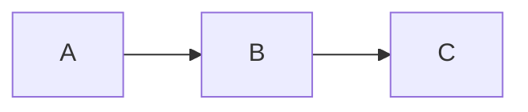

# 语雀Markdown格式指南

语雀完整支持 CommonMark + GFM,并扩展了若干显示控件。本skill的 `format_helpers.py` 提供了大部分扩展的安全生成器。

## 标题、段落、列表

| Markdown | 渲染 |
|---|---|
| `# 标题1`…`###### 标题6` | 一级到六级标题 |
| `- 项 / * 项` | 无序列表 |
| `1. 项` | 有序列表 |
| `- [ ] 任务 / - [x] 已做` | 任务列表 |
| `> 引用` | 引用块 |
| `---` | 分隔线 |

## 字号与颜色

语雀同时识别 `<font>` 和 `<span style>`,推荐 `<span style>` 因为颗粒度细。

```markdown
<font color="#FF0000">红色文本</font>
<font color="#1890FF" size="6">大蓝字</font>     <!-- size 1-7 -->
<span style="color:#FF6A00;font-size:24px;font-weight:bold">大号橙色加粗</span>
<span style="background-color:#FFFB8F">高亮黄背景</span>
```

`format_helpers.py` 对应:

```python
colored("重要", "#E03131")
sized("摘要正文", "16px")
styled("标题", color="#1864AB", size="22px", bold=True, underline=True)
```

## 警示框 / 折叠块

语雀支持 docusaurus 风格的 `:::` 块。

```markdown
:::info
普通提示
:::

:::warning 注意
潜在风险
:::

:::danger
危险!
:::

:::success
完成
:::

:::tips 操作技巧
小贴士
:::

:::details 点击展开
被折叠的长文……
:::
```

对应:`callout("...", kind="warning", title="注意")`、`collapsible("...", "点击展开")`。

## 表格

GFM表格,支持对齐符号:

```markdown
| 列1 | 列2 | 列3 |
| :--- | :---: | ---: |
| 左 | 中 | 右 |
```

复杂内容(换行/管道)需转义:`\n` → `<br>`,`|` → `\|`。`format_helpers.table()` 自动处理。

## 代码块、Mermaid、思维导图、公式

````markdown
```python
def hello():
    print("hi")
```



```mind
- 中心主题
  - 分支1
  - 分支2
```
````

公式:

```markdown
行内 $E=mc^2$;

行间:

$$
\int_0^1 x^2 dx = \frac{1}{3}
$$
```

## 锚点与跳转

```markdown
<a name="section-1"></a>
## 第一节

[跳转到第一节](#section-1)
```

`toc_anchor("第一节", "section-1")` 生成首行。

## 标签

```markdown
本文档与 #项目复盘# #2026Q1# 相关
```

`tag("项目复盘", "2026Q1")`。

## 不要直接写的元素(可能触发422)

- `<script>` `<iframe>` `<object>` `<embed>` —— 用 `format_helpers.sanitize(body)` 自动剥除。
- 含 `javascript:` 协议的链接。
- 超过 5MB 的单篇正文(语雀硬上限),需要 `batch.py` 拆分。

## 常用模板

把会议纪要做成结构化文档:

```markdown
# 2026-04-28 周会纪要

> 出席:张三、李四、王五

:::info 决议
1. 下周完成 X
2. 推迟 Y
:::

## 讨论事项

| # | 主题 | 负责人 | 截止 |
| :--- | --- | --- | --- |
| 1 | …  | 张三 | 05-05 |

## 行动项
- [ ] 张三:落地 X
- [ ] 李四:跟进 Y
```
