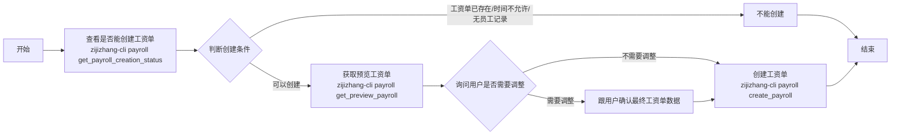

# 工资单工作流

## 创建工资单

写操作保护：

- `create_payroll` 属于写操作，执行前必须向用户回显最终提交的 `month`、`uid`、工资单 JSON 数据摘要，以及每个字段来源
- 允许直接使用 `get_preview_payroll` 返回的数据，或用户明确要求修改后的值
- 严禁自行编造员工姓名、证件号码、收入、社保、公积金、奖金、补偿金等字段

### 创建流程



### Step 1

了解用户需要创建工资单的月份 `month`，如果用户没有明确告知或用户表示创建`本期`工资单，则默认为上个月份。
例如：现在是2026年4月，用户没有明确告知，则默认为3月，即 `month='2026-03'`

### Step 2

获取工资单创建状态

```shell
zijizhang-cli payroll get_payroll_creation_status '<month>'
```

当且仅当上面命令返回的 `has_ryxx` = false、`is_time_allowed` = true、`already_exist` = false 时，才继续执行 Step 3，否则直接结束

> 具体参数可参考 `$SKILLS_ROOT/references/get_payroll_creation_status.md`

### Step 3

获取预览的工资单

```shell
zijizhang-cli payroll get_preview_payroll '<month>'
```

> 具体参数可参考 `$SKILLS_ROOT/references/get_preview_payroll.md`

### Step 4

根据获取的预览工资单，按照以下模版转换成可视化ui展示给用户，然后让用户确认是否需要调整

展示要求：

- 表格结构必须严格按照以下固定表头展示，不允许修改列名、顺序、结构
- 若后端未返回某字段，只能展示为空/未返回，不能自行补值

展示例子：

- 如果结果中只有一条记录，建议按“员工姓名 / 证件号码 / 本期收入 / 个人社保公积金 / 企业社保公积金”分组展示

```markdown
| 项目 | 内容 |
| :--- | :--- |
| **员工姓名** | {xm} |
| **证件号码** | {zjhm} |
| **本期收入** | {bqsr} 元 |
| **个人社保公积金** | |
| 住房公积金 | {gr_zfgjj} 元 |
| 养老保险 | {gr_jbpbxf} 元 |
| 医疗保险 | {gr_jbmbxf} 元 |
| 失业保险 | {gr_sybxf} 元 |
| **企业社保公积金** | |
| 住房公积金 | {qy_zfgjj} 元 |
| 养老保险 | {qy_jbpbxf} 元 |
| 医疗保险 | {qy_jbmbxf} 元 |
| 失业保险 | {qy_sybxf} 元 |
| 工伤保险 | {qy_gsbxf} 元 |
```

- 如果结果中有多条记录，建议按表格展示

```markdown
| 姓名 | 证件号码 | 本期收入 | 个人公积金 | 个人-养老保险 | 个人-医疗保险 | 个人-失业保险 | 企业-公积金 | 企业-养老保险 | 企业-医疗保险 | 企业-失业保险 | 企业-工伤保险 |
| :--- | :--- | :--- | :--- | :--- | :--- | :--- | :--- | :--- | :--- | :--- | :--- |
| {xm} | {zjhm} | {bqsr} | {gr_zfgjj} | {gr_jbpbxf} | {gr_jbmbxf} | {gr_sybxf} | {qy_zfgjj} | {qy_jbpbxf} | {qy_jbmbxf} | {qy_sybxf} | {qy_gsbxf} |
```

### Step 5

按照用户最终调整内容，先回显最终待提交数据，再等待用户确认。

回显时至少包含：

- `month`
- `uid`
- 员工人数
- 每位员工的关键字段摘要
- 哪些值来自 `get_preview_payroll`
- 哪些值来自用户修改

只有用户明确确认后，才可以创建工资单

```shell
zijizhang-cli payroll create_payroll '<month>' '<data>'
```

> 具体参数可参考 `$SKILLS_ROOT/references/create_payroll.md`

期望结果：

- `code=200`

失败分支：

- `code!=200`：停止推进，向用户反馈 `msg`

## 查询工资单

### Step 1

了解用户需要查询工资单的月份 `month`，如果用户没有明确告知或用户表示查询`本期`工资单，则默认为上个月份。
例如：现在是2026年4月，用户没有明确告知，则默认为3月，即 `month='2026-03'`

### Step 2

获取工资单

```shell
zijizhang-cli payroll get_payroll '<month>'
```

> 具体参数可参考 `$SKILLS_ROOT/references/get_payroll.md`

### Step 3

根据获取的工资单，按照以下模版转换成可视化ui展示给用户

要求：
- 表格结构必须严格按照以下固定表头展示，不允许修改列名、顺序、结构
- 若返回结果缺字段，只能按“空值/未返回”展示，不能自行补值

展示例子：

- 如果结果中只有一条记录，建议按“基本信息 / 收入与奖金 / 个人扣款明细 / 企业缴纳明细 / 税务信息”分组展示

```markdown
| 项目 | 内容 |
| :--- | :--- |
| **基本信息** | |
| 员工姓名 | {xm} |
| 证件号码 | {zjhm} |
| **收入与奖金** | |
| 本期收入 | {bqsr} 元 |
| 全年一次性奖金 | {qnycxjj} 元 |
| 离职补偿金 | {lzbcj} 元 |
| **个人扣款明细** | |
| 住房公积金 | {gr_zfgjj} 元 |
| 养老保险 | {gr_jbpbxf} 元 |
| 医疗保险 | {gr_jbmbxf} 元 |
| 失业保险 | {gr_sybxf} 元 |
| 其他保险费 | {gr_qt} 元 |
| 个人备注 | {gr_bz} |
| **企业缴纳明细** | |
| 住房公积金 | {qy_zfgjj} 元 |
| 养老保险 | {qy_jbpbxf} 元 |
| 医疗保险 | {qy_jbmbxf} 元 |
| 失业保险 | {qy_sybxf} 元 |
| 工伤保险 | {qy_gsbxf} 元 |
| 其他保险费 | {qy_qt} 元 |
| 企业备注 | {qy_bz} |
| **税务信息** | |
| **个税** | **{gs} 元** |
```

- 如果结果中有多条记录，建议按表格展示

```markdown
| 姓名 | 证件号码 | 本期收入 | 全年一次性奖金 | 离职补偿金 | 个人-养老保险 | 个人-医疗保险 | 个人-失业保险 | 个人-其他保险 | 个人-公积金 | 个人-备注 | 企业-养老保险 | 企业-医疗保险 | 企业-失业保险 | 企业-工伤保险 | 企业-其他保险 | 企业-公积金 | 企业-备注 | 个税 |
| :--- | :--- | :--- | :--- | :--- | :--- | :--- | :--- | :--- | :--- | :--- | :--- | :--- | :--- | :--- | :--- | :--- | :--- | :--- |
| {xm} | {zjhm} | {bqsr} | {qnycxjj} | {lzbcj} | {gr_jbpbxf} | {gr_jbmbxf} | {gr_sybxf} | {gr_qt} | {gr_zfgjj} | {gr_bz} | {qy_jbpbxf} | {qy_jbmbxf} | {qy_sybxf} | {qy_gsbxf} | {qy_qt} | {qy_zfgjj} | {qy_bz} | {gs} |
```
