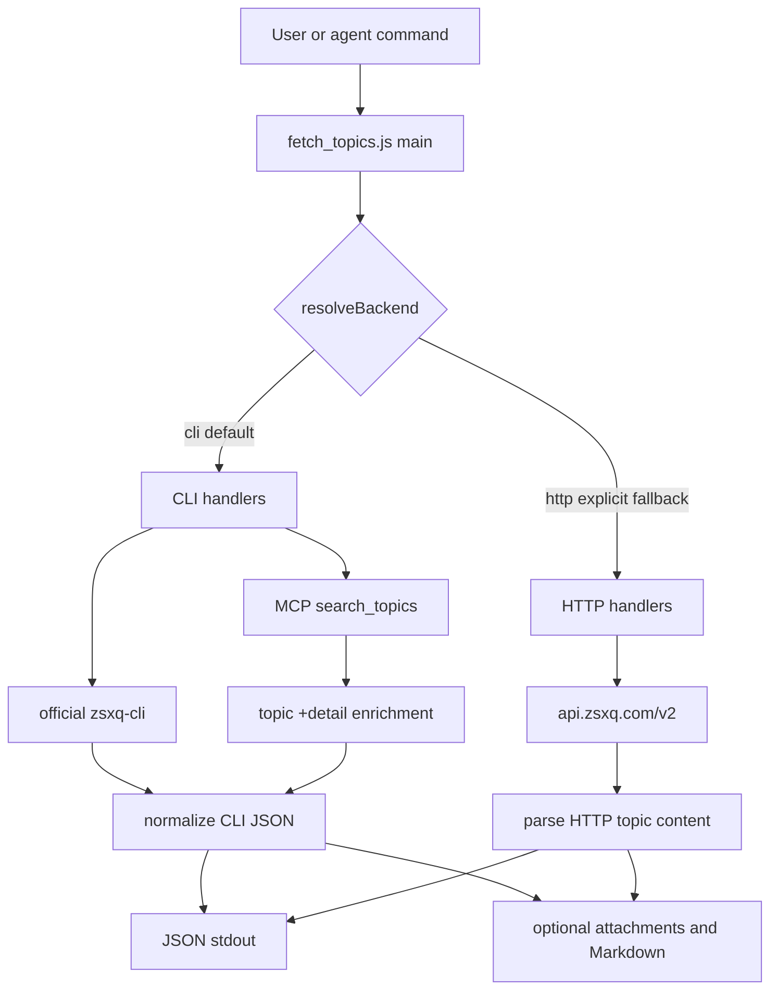
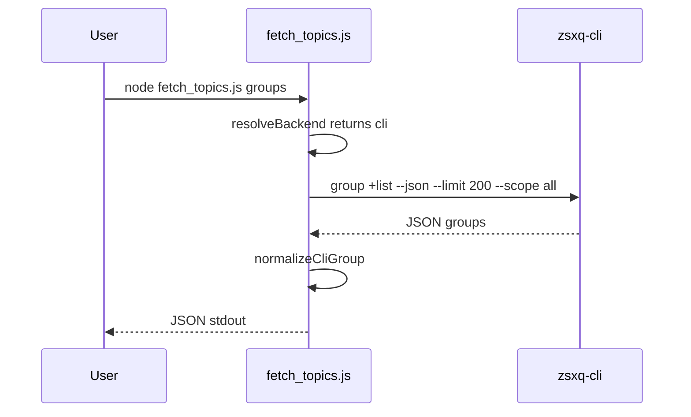
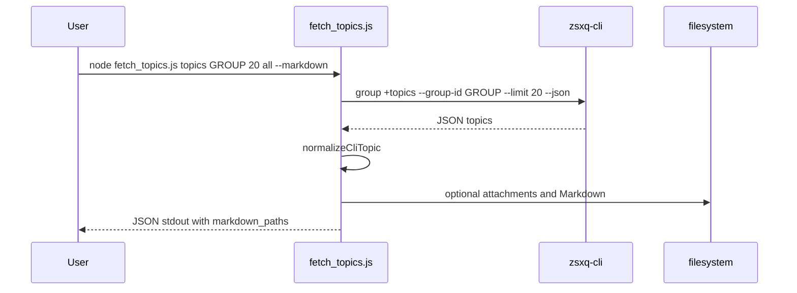
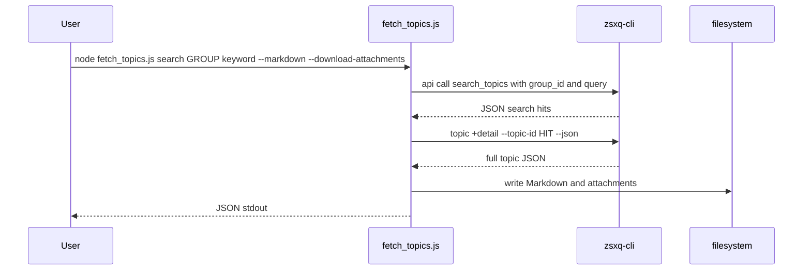
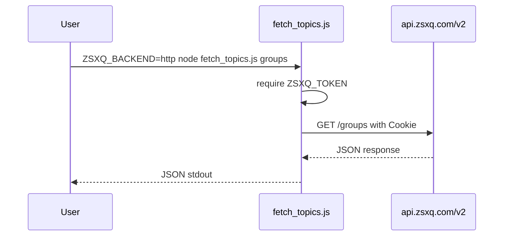

# zsxq-post-fetch Architecture

## Executive Summary

`zsxq-post-fetch` is a single-script Node.js skill that exposes knowledge-planet
fetching commands through `fetch_topics.js`. As of version 1.1.0, the default
backend is the official `zsxq-cli` OAuth/Keychain flow. The direct
`api.zsxq.com/v2` HTTP path remains available only when `ZSXQ_BACKEND=http` or
`config.json.backend` is set to `"http"`. Version 1.2.0 adds keyword search via
the official MCP `search_topics` tool exposed by `zsxq-cli api call`.

This change moves authentication responsibility to the official CLI and avoids
continuing to simulate non-official clients after Knowledge Planet returns
`code: 1059`.

## How to Run and Verify

```bash
bash install.sh
npm test
node fetch_topics.js groups
ZSXQ_BACKEND=http node fetch_topics.js groups
```

Expected behavior:

- Default commands call `zsxq-cli` and require `zsxq-cli auth login`.
- `ZSXQ_BACKEND=http` requires `ZSXQ_TOKEN`.
- Unit tests cover backend selection, CLI command construction,
  normalization, digest marker availability, CLI error mapping, Markdown, and
  attachment filename behavior.

## Repository Map

| Path | Responsibility |
| --- | --- |
| `fetch_topics.js` | CLI entry point, backend selection, official CLI runner, legacy HTTP runner, normalization, Markdown and attachment side effects |
| `config.json` | Default runtime config, including `backend`, attachment root, and attachment download flag |
| `groups.json` | User-editable list of target groups and default scopes |
| `install.sh` | Node and `zsxq-cli` installation/status checks |
| `SKILL.md` | ClawHub/Clawdbot skill metadata and agent prompt instructions |
| `README.md` | User-facing install, auth, usage, fallback, and 1059 guidance |
| `references/api-reference.md` | Backend command/API reference |
| `test/fetch_topics.helpers.test.js` | Node test suite for pure helpers and injected CLI runner behavior |

## Architecture and Module Responsibilities



### Backend Selection

`resolveBackend` returns `cli` by default, honors `ZSXQ_BACKEND`, and uses
`config.json.backend` only when no environment override is present. Evidence:
`fetch_topics.js:34`, `config.json:2`, tests at
`test/fetch_topics.helpers.test.js:16`.

### Official CLI Backend

The CLI backend builds stable `zsxq-cli` commands for groups, topic lists, and
single topic detail. Evidence: command builders at `fetch_topics.js:133`,
`fetch_topics.js:140`, CLI runner at `fetch_topics.js:169`, handlers at
`fetch_topics.js:1232`, `fetch_topics.js:1399`, and `fetch_topics.js:1433`.

CLI JSON is normalized into the existing topic/group model so downstream
Markdown, attachment, and summarization behavior can remain stable. Evidence:
`normalizeCliTopic` at `fetch_topics.js:297`, `normalizeCliGroup` near
`fetch_topics.js:341`, tests at `test/fetch_topics.helpers.test.js:196` and
`test/fetch_topics.helpers.test.js:230`.

### Legacy HTTP Backend

Existing direct HTTP behavior is preserved behind `fetchTopicsHttp`,
`fetchTopicsByDateHttp`, `fetchTopicHttp`, and `fetchGroupsHttp`. Evidence:
`fetch_topics.js:842` and dispatcher functions at `fetch_topics.js:1444`.

The main entry point requires `ZSXQ_TOKEN` only when the resolved backend is
`http`. Evidence: `fetch_topics.js:1489`, `fetch_topics.js:1494`.

## Critical Workflows

### Default Groups Workflow



### Default Topics Workflow



### Default Search Workflow



`search_topics` currently documents `group_id` and `query`, but no pagination
arguments. The script treats command `count` as a client-side cap over one
official search call, then enriches hits with `topic +detail`. Evidence:
`fetch_topics.js` command builder and `collectSearchTopicsCli`, plus tests in
`test/fetch_topics.helpers.test.js`.

### Explicit HTTP Fallback Workflow



## Data Model and Persistence

The normalized topic model keeps the prior fields:

- `topic_id`, `type`, `title`, `text`, `create_time`, `owner`
- `likes_count`, `comments_count`, `reading_count`, `readers_count`
- `digested`, `image_count`, `file_count`, `images`, `files`
- optional `attachments_local` and `markdown_paths`

The script has no database. Persistence is limited to:

- Markdown files at `<attachment_dir>/<group_id>/<YYYY-MM-DD>.md`
- downloaded attachments under `<attachment_dir>/<group_id>/<YYYY-MM-DD>/`
- user-maintained config in `config.json` and `groups.json`

Evidence: Markdown helpers and attachment helpers are tested in
`test/fetch_topics.helpers.test.js`, and the runtime config is documented in
`README.md:82` and `SKILL.md:87`.

## External Integrations

| Integration | Default | Purpose |
| --- | --- | --- |
| `zsxq-cli` | Yes | Official OAuth/Keychain auth and data access |
| `api.zsxq.com/v2` | No | Legacy fallback only when explicitly selected |
| Local filesystem | Optional | Markdown and attachment output |

Install/auth guidance is implemented in `install.sh:21`, `install.sh:51`,
`README.md:53`, and `SKILL.md:36`.

## Tests and Quality Gates

The test suite runs with Node's built-in test runner:

```bash
npm test
```

Coverage added for this architecture change:

- backend selection: `test/fetch_topics.helpers.test.js:16`
- CLI command builders: `test/fetch_topics.helpers.test.js:177`
- CLI topic/group normalization: `test/fetch_topics.helpers.test.js:196`
- digest marker availability: `test/fetch_topics.helpers.test.js:230`
- CLI missing/login/non-JSON errors: `test/fetch_topics.helpers.test.js:251`
- keyword search arguments, MCP command construction, detail fallback, and
  local HTTP filtering are covered in `test/fetch_topics.helpers.test.js`.

## Risks, Assumptions, and Unknowns

- Assumption: the installed official `zsxq-cli` exposes the documented
  `group +list`, `group +topics`, and `topic +detail` commands with `--json`.
  Evidence: README and reference docs record those commands, but real output can
  vary by CLI version.
- Risk: if `zsxq-cli group +topics` omits digest markers, `digests` cannot be
  safely preserved. The script returns `digests_unavailable_from_cli` instead of
  falling back automatically. Evidence: `fetch_topics.js:1268`,
  `README.md:164`.
- Risk: attachment files without `url` or `download_url` may still need the
  legacy HTTP download-url endpoint and therefore a legacy `ZSXQ_TOKEN`.
  Evidence: `SKILL.md:240`, `references/api-reference.md:192`.
- Assumption: callers prefer safety over completeness for 1059 cases. The
  implementation does not spoof official clients or bypass risk controls.
  Evidence: `README.md:237`, `SKILL.md:255`,
  `references/api-reference.md:219`.
